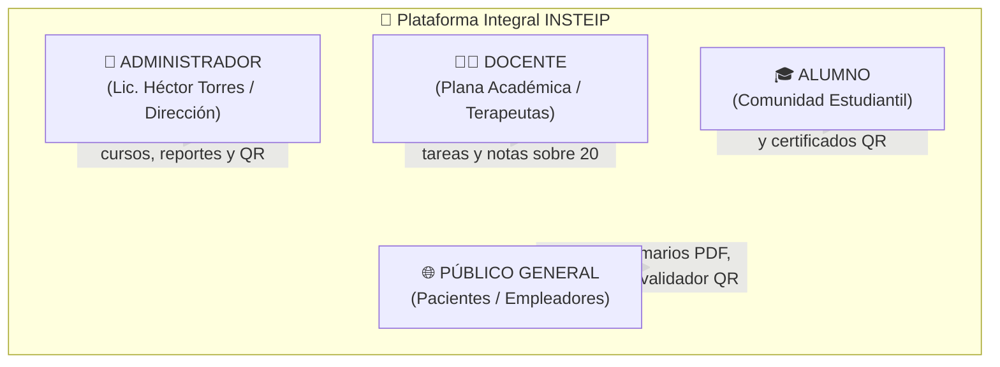
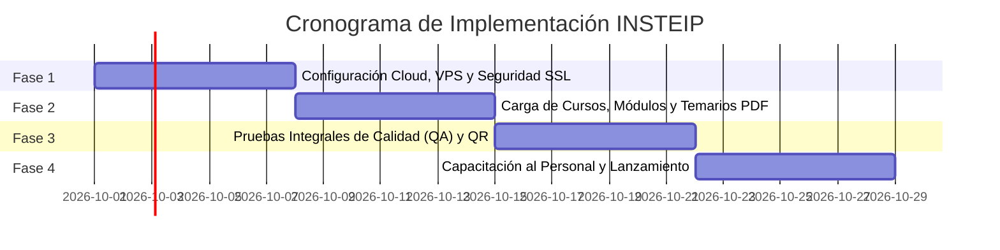

# 🌿 INSTEIP - INSTITUTO SUPERIOR DE TERAPIAS INTEGRALES Y PROFESIONALES

# PROPUESTA TÉCNICO - ECONÓMICA DE SERVICIOS
## SISTEMA INTEGRAL DE GESTIÓN ACADÉMICA Y CAMPUS VIRTUAL

---

| Campo | Detalle Oficial |
| :--- | :--- |
| **Presentado Exclusivamente A:** | **LIC. HÉCTOR TORRES** (Director General / Representante Institucional) |
| **Institución Beneficiaria:** | **INSTITUTO SUPERIOR INSTEIP** |
| **Sedes Involucradas:** | Sede Principal Lima (Lince), Sede Huánuco, Sede Piura y Campus Virtual Online |
| **Versión del Sistema:** | Edición Enterprise 2026 (v1.0) |
| **Arquitectura:** | Nube Dedicada de Alta Disponibilidad 24/7 (Acceso Web y Móvil) |
| **Fecha de Emisión:** | Septiembre 2026 |
| **Vigencia de la Oferta:** | 30 días calendario |
| **Carácter del Documento:** | Estrictamente Confidencial &bull; Propuesta Llave en Mano |

---

## 📑 Índice de Contenido

1. [Carta de Presentación y Resumen Ejecutivo](#1-carta-de-presentación-y-resumen-ejecutivo)
2. [Enfoque No Técnico: ¿Cómo funciona en el día a día?](#2-enfoque-no-técnico-cómo-funciona-en-el-día-a-día)
3. [Mapa Detallado de Roles y Permisos de Acceso](#3-mapa-detallado-de-roles-y-permisos-de-acceso)
   - 3.1. Rol Administrador / Dirección General
   - 3.2. Rol Docente / Plana Académica
   - 3.3. Rol Alumno / Estudiante
   - 3.4. Rol Público General / Visitantes / Empleadores
4. [Catálogo de Módulos y Funcionalidades del Sistema](#4-catálogo-de-módulos-y-funcionalidades-del-sistema)
5. [Propuesta Económica y Plan de Inversión](#5-propuesta-económica-y-plan-de-inversión)
6. [Modalidades y Facilidades de Pago](#6-modalidades-y-facilidades-de-pago)
7. [Comparativa de Rentabilidad vs. Plataformas Externas](#7-comparativa-de-rentabilidad-vs-plataformas-externas)
8. [Retorno de Inversión Estimado (ROI)](#8-retorno-de-inversión-estimado-roi)
9. [Cronograma de Trabajo y Fases de Entrega](#9-cronograma-de-trabajo-y-fases-de-entrega)
10. [Garantía, Soporte y Compromiso de Calidad](#10-garantía-soporte-y-compromiso-de-calidad)
11. [Acta de Conformidad y Aceptación](#11-acta-de-conformidad-y-aceptación)

---

## 1. Carta de Presentación y Resumen Ejecutivo

**Estimado Lic. Héctor Torres:**

Es un honor presentarle la **Propuesta Técnico-Económica para la Implementación del Sistema Integral de Gestión Académica y Campus Virtual de INSTEIP**.

En la actualidad, las instituciones educativas líderes en medicina alternativa, salud integrativa y formación profesional demandan soluciones tecnológicas propias que les permitan romper barreras geográficas, captar estudiantes a nivel nacional e internacional, y brindar una experiencia de aprendizaje moderna sin depender de comisiones abusivas cobradas por plataformas de terceros.

Esta solución ha sido diseñada y adaptada con base en la oferta académica real de **INSTEIP** (Acupuntura Tradicional China de 7 y 12 meses, Auriculoterapia, Digitopresión Mecánica, Masaje Terapéutico, Fitoterapia, Dietética, Aromaterapia y talleres especializados). 

### 🎯 Objetivos Estratégicos que Logra INSTEIP con la Plataforma:
1. **0% de Comisiones por Estudiante:** La plataforma y la base de datos pertenecen 100% a INSTEIP. La institución no transfiere entre el 10% y el 15% de cada venta como ocurre en servicios como Hotmart o Teachable.
2. **Expansión y Matrículas 24/7:** Permite captar alumnos de Lima, Huánuco, Piura, provincias de todo el Perú y del extranjero, quienes pueden estudiar a su propio ritmo en cualquier momento del día.
3. **Automatización Docente Completa:** Sustituye el caos de recibir tareas por WhatsApp o correos sueltos por un aula virtual ordenada donde los profesores publican asignaciones, reciben entregas en PDF/Word, califican sobre 20 y retroalimentan al alumno con observaciones pedagógicas.
4. **Respaldo Antifraude mediante Código QR:** Cada certificado emitido contiene un código QR único que vincula directamente a la base de datos oficial del instituto, permitiendo a clínicas, hospitales, pacientes o empleadores comprobar la autenticidad del diplomado de forma inmediata.

---

## 2. Enfoque No Técnico: ¿Cómo funciona en el día a día?

El sistema está concebido para ser utilizado de manera intuitiva, sin necesidad de conocimientos avanzados de informática:

* 📱 **Multiplataforma y Móvil:** Los alumnos y profesores pueden ingresar desde sus teléfonos inteligentes, tablets, laptops o computadoras de escritorio sin instalar aplicaciones pesadas.
* 🎬 **Experiencia tipo Streaming (Fácil como Netflix):** El estudiante entra a su aula, da clic a su curso y continúa viendo su clase en el minuto exacto donde la dejó la sesión anterior.
* 🔒 **Seguridad y Privacidad Garantizada:** Las clases, videos y materiales didácticos están protegidos para que únicamente los alumnos con matrícula activa puedan acceder a ellos.
* ⚡ **Operación Continua sin Interrupciones:** El sistema se encuentra hospedado en un servidor dedicado en la nube con copias de seguridad periódicas para asegurar que la información nunca se extravíe.

---

## 3. Mapa Detallado de Roles y Permisos de Acceso

El sistema organiza los accesos mediante **Roles**, garantizando que cada usuario vea únicamente lo que le corresponde:

---

### 3.1. 👑 Rol Administrador / Dirección General
*Dirigido a: Lic. Héctor Torres, Directorio Institucional y Personal Administrativo Central.*

#### 👁️ ¿Qué puede VER el Administrador?
1. **Consola Central de Métricas (Dashboard):** Indicadores en tiempo real sobre la cantidad de alumnos activos, total de docentes, catálogo de cursos habilitados y tasa de avance general.
2. **Directorio Central de Usuarios:** Lista completa de alumnos y profesores con sus datos de contacto (nombres, DNI, teléfono, correo electrónico, sede y fecha de registro).
3. **Catálogo Curricular Completo:** Vista de todos los diplomados, módulos temáticos, lecciones en video y materiales en PDF subidos a la plataforma.
4. **Historial de Certificados Emitidos:** Relación detallada de diplomas otorgados, notas finales, fechas de emisión y enlaces de validación QR.
5. **Registro de Auditoría y Seguridad:** Bitácora de accesos con fecha, hora exacta, usuario y acciones efectuadas para control interno.
6. **Estado del Servidor y Copias de Seguridad:** Información sobre el rendimiento del sistema y respaldo de bases de datos.

#### ⚡ ¿Qué puede HACER el Administrador?
1. **Matricular y Gestionar Alumnos:** Dar de alta a nuevos estudiantes y matricularlos en uno o varios diplomados en segundos. Activar o suspender cuentas según el estado de pagos.
2. **Crear y Asignar Docentes:** Registrar a los profesores en el sistema y asignarles la titularidad de los cursos correspondientes.
3. **Crear y Editar Cursos y Temarios:** Crear nuevos diplomados o talleres, estructurar módulos temáticos, subir enlaces de video y anexar manuales PDF.
4. **Emitir Certificados Digitales Oficiales:** Generar diplomas en PDF con diseño oficial de INSTEIP, firmas institucionales y código QR antifraude.
5. **Emitir Comunicados Segmentados:** Redactar avisos institucionales para toda la comunidad, únicamente para docentes, solo para alumnos o para un curso específico.
6. **Lanzar Banners y Pop-ups Promocionales:** Configurar ventanas emergentes en el portal web con promociones o talleres de temporada enlazados a WhatsApp.
7. **Descargar Copias de Respaldo:** Generar copias de seguridad de la base de datos institucional con un solo clic.

---

### 3.2. 👨‍🏫 Rol Docente / Plana Académica
*Dirigido a: Profesores, Especialistas y Terapeutas a cargo del dictado de clases.*

#### 👁️ ¿Qué puede VER el Docente?
1. **Sus Cursos Asignados:** Exclusivamente los diplomados o asignaturas que la Dirección le ha delegado (sin acceso a información confidencial de otros cursos).
2. **Lista de sus Alumnos:** Nómina de estudiantes matriculados en sus aulas virtuales con sus canales de contacto.
3. **Seguimiento de Avance:** Monitoreo del avance de cada estudiante (porcentaje de lecciones en video vistas).
4. **Bandeja de Tareas Recibidas:** Trabajos prácticos enviados por los alumnos listos para su revisión.
5. **Historial de Calificaciones:** Registro de notas emitidas y observaciones pedagógicas otorgadas.

#### ⚡ ¿Qué puede HACER el Docente?
1. **Administrar el Contenido de su Curso:** Subir lecciones en video, actualizar enlaces y adjuntar guías didácticas o atlas clínicos en PDF.
2. **Crear Asignaciones y Tareas:** Publicar trabajos prácticos con indicaciones detalladas y fechas límite de entrega.
3. **Descargar y Evaluar Trabajos:** Abrir los archivos enviados por los alumnos (PDF o Word) desde la misma plataforma.
4. **Calificar con Escala Vigesimal (0 a 20):** Colocar la nota oficial correspondiente a cada trabajo entregado.
5. **Brindar Retroalimentación Personalizada:** Escribir comentarios con recomendaciones clínicas, correcciones o felicitaciones pedagógicas al alumno.

---

### 3.3. 🎓 Rol Alumno / Estudiante
*Dirigido a: Estudiantes de diplomados, talleres y cursos virtuales o semipresenciales.*

#### 👁️ ¿Qué puede VER el Alumno?
1. **Panel "Mis Cursos":** Catálogo personalizado con las materias en las que se encuentra formalmente matriculado.
2. **Aula Virtual Multimedia:** Reproductor de videoclases organizado por módulos temáticos, con opción de pantalla completa y subtítulos.
3. **Barra de Avance Porcentual:** Indicador visual que muestra qué porcentaje del curso ha completado.
4. **Biblioteca de Materiales Descargables:** Acceso a manuales, diapositivas y guías en PDF autorizadas por el profesor.
5. **Sección de Tareas y Calificaciones:** Listado de asignaciones pendientes, fechas de entrega, notas obtenidas y comentarios de su profesor.
6. **Mis Certificados:** Diplomas oficiales obtenidos listos para su descarga en PDF con código QR verificable.
7. **Campanita de Notificaciones:** Avisos en tiempo real sobre nuevas clases subidas, tareas publicadas o calificaciones listas.

#### ⚡ ¿Qué puede HACER el Alumno?
1. **Estudiar a Propio Ritmo (24/7):** Visualizar sus clases cuantas veces requiera; el sistema recuerda automáticamente el minuto donde se quedó.
2. **Descargar Material de Apoyo:** Bajar a su computadora o celular los manuales de estudio.
3. **Subir Tareas Resueltas:** Adjuntar sus archivos de entrega (PDF o Word) antes de que venza el plazo fijado por el docente.
4. **Descargar su Diploma Oficial:** Obtener su certificado con código QR una vez culminado y aprobado el diplomado.
5. **Consultar al Asistente Virtual Inteligente:** Resolver preguntas frecuentes sobre clases, fechas y trámites de manera inmediata.
6. **Administrar su Perfil:** Actualizar su clave de acceso y datos personales de manera segura.

---

### 3.4. 🌐 Rol Público General / Visitantes / Empleadores
*Dirigido a: Prospectos interesados, público en general, pacientes, clínicas y centros de salud.*

#### 👁️ ¿Qué puede VER el Público General?
1. **Portal Web Institucional:** Información sobre la trayectoria de INSTEIP, especialidades y sedes (Lima, Huánuco, Piura).
2. **Catálogo de Formación:** Oferta completa de diplomados presenciales y cursos virtuales.
3. **Fichas Informativas de Cursos:** Duración, metodología, costos y perfil del egresado.
4. **Validador Público de Certificados QR:** Módulo web para verificar la legitimidad de un diploma emitido por INSTEIP.

#### ⚡ ¿Qué puede HACER el Público General?
1. **Descargar Temarios Oficiales en PDF:** Obtener el plan de estudios de los cursos principales con un solo clic.
2. **Contactar Directamente por WhatsApp:** Botones enlazados con las áreas de admisión de Lima y Huánuco para matricularse.
3. **Validar Certificados Escaneando el QR:** Comprobar al instante la autenticidad, la nota y la validez legal de cualquier egresado.
4. **Consultar al Asistente Virtual 24/7:** Hacer preguntas al Chatbot con IA sobre precios, horarios y requisitos.
5. **Iniciar Sesión:** Acceder al campus virtual en caso de contar con credenciales de alumno o docente.

---

## 4. Catálogo de Módulos y Funcionalidades del Sistema

A continuación se detalla la función que cumple cada componente en la operación diaria del instituto:

| N° | Módulo | Área / Categoría | Función Operativa en el Día a Día | Beneficio para INSTEIP |
| :---: | :--- | :--- | :--- | :--- |
| **01** | **Portal Web Comercial y Catálogo Dinámico** | Atracción y Ventas | Muestra en Internet los diplomados, beneficios, sedes y temarios en PDF con botón directo a WhatsApp. | Multiplica la captación de prospectos y proyecta seriedad institucional. |
| **02** | **Seguridad y Control de Accesos** | Protección de Datos | Gestiona inicios de sesión seguros y restringe clases y materiales únicamente a alumnos matriculados. | Evita la piratería de contenidos y protege los datos personales. |
| **03** | **Panel de Control Gerencial (Dashboard)** | Dirección General | Muestra a la directiva métricas en tiempo real de alumnos, cursos activos, profesores y actividad. | Permite tomar decisiones inmediatas sin solicitar informes manuales. |
| **04** | **Gestión de Alumnos y Matrícula Rápida** | Control Escolar | Permite registrar alumnos (DNI, teléfono, email) y matricularlos en cursos en un par de clics. | Elimina las listas en papel y el desorden de hojas de cálculo en Excel. |
| **05** | **Gestión Docente y Asignación de Cursos** | Coordinación Académica | Mantiene el padrón de profesores y delega qué cursos tiene a cargo cada uno. | Claridad total en las responsabilidades pedagógicas de la plana docente. |
| **06** | **Gestor Curricular de Cursos y Módulos** | Organización Pedagógica | Estructura diplomados en módulos temáticos ordenados con lecciones en video y manuales PDF. | Garantiza una enseñanza estructurada y fácil de asimilar para el alumno. |
| **07** | **Aula Virtual y Reproductor Inteligente 24/7** | Campus Virtual | Reproductor de video HD que recuerda el minuto visto, marca lecciones completadas y mide el progreso. | Reduce la deserción y ofrece una experiencia moderna similar a Netflix. |
| **08** | **Sistema de Tareas, Evaluaciones y Calificaciones** | Evaluación Académica | Los profesores asignan tareas, reciben archivos (PDF/Word), califican de 0 a 20 y dejan notas formativas. | Asegura la alta calidad formativa del egresado mediante evaluaciones reales. |
| **09** | **Certificación Digital Inteligente con QR** | Acreditación Oficial | Genera diplomas oficiales en PDF con código QR que valida su autenticidad ante cualquier empleador. | Da prestigio oficial y previene cualquier intento de falsificación de títulos. |
| **10** | **Comunicados Segmentados y Pop-ups** | Comunicación y Marketing | Envía avisos a toda la escuela o por cursos específicos, y publica banners de promociones y talleres. | Canal directo de comunicación interna y motor de venta de cursos adicionales. |
| **11** | **Centro de Notificaciones en Vivo (Campanita)** | Interacción en Tiempo Real | Alerta al alumno cuando se sube una clase nueva, se publica una tarea o se emite una nota. | Mantiene al alumno permanentemente conectado y motivado con sus estudios. |
| **12** | **Asistente Virtual con IA (Chatbot 24/7)** | Atención al Cliente | Responde dudas sobre costos, temarios y sedes las 24 horas del día, derivando a WhatsApp. | Atiende clientes de noche y fines de semana sin requerir personal de turno. |
| **13** | **Auditoría Forense y Copias de Seguridad** | Soporte e Infraestructura | Registra ingresos al sistema y efectúa copias de seguridad de notas y alumnos periódicamente. | Respaldo y blindaje total de la información institucional ante contingencias. |
| **14** | **Configuración Institucional y Marca** | Identidad Corporativa | Permite actualizar logotipos, teléfonos, sedes y textos institucionales de forma autónoma. | Independencia total para INSTEIP sin pagos a programadores por cambios menores. |

---

## 5. Propuesta Económica y Plan de Inversión

La propuesta se cotiza bajo la modalidad de **Proyecto Integral "Llave en Mano"**, entregando el sistema instalado, configurado y listo para su uso:

| Ítem | Concepto / Componente del Sistema | Estado / Modalidad | Inversión (Soles) |
| :---: | :--- | :---: | :---: |
| **01** | **Portal Web Institucional y Catálogo Comercial Dinámico** Fichas informativas, temarios descargables en PDF, diseño adaptado a celulares y enlace directo a WhatsApp. | Implementado | S/ 1,800.00 |
| **02** | **Campus Virtual 24/7 y Aula de Aprendizaje Multimedia** Módulos temáticos, reproductor inteligente con guardado de minuto visto, control de avance y biblioteca PDF. | Implementado | S/ 3,200.00 |
| **03** | **Módulo de Tareas, Evaluaciones y Calificaciones Docentes** Subida de tareas (PDF/Word), panel de revisión para docentes, escala de 0 a 20 y comentarios pedagógicos. | Implementado | S/ 1,900.00 |
| **04** | **Sistema de Certificación Digital con Verificación QR Antifraude** Emisión de diplomas oficiales en PDF de alta resolución y módulo de validación pública institucional. | Implementado | S/ 1,600.00 |
| **05** | **Consola de Administración, Comunicados y Pop-ups Promocionales** Dashboard directivo, matriculación rápida, gestión docente, avisos masivos y banners emergentes. | Implementado | S/ 2,100.00 |
| **06** | **Asistente Virtual con Inteligencia Artificial (Chatbot 24/7)** Chatbot entrenado con la oferta de INSTEIP para responder consultas de interesados día y noche. | Implementado | S/ 1,400.00 |
| **07** | **Infraestructura Cloud, Servidor Dedicado y Seguridad SSL** Configuración de VPS de alto rendimiento (6 núcleos, 12GB RAM), dominio https://insteip.com y backups. | Incluido | S/ 1,200.00 |
| **08** | **Capacitación al Personal, Carga de Cursos y Soporte Técnico** Entrenamiento a directivos y docentes, manuales de usuario paso a paso y 3 meses de soporte gratuito. | Garantía Total | S/ 1,200.00 |
| **TOTAL** | **VALOR TOTAL DEL PROYECTO (LLAVE EN MANO)** | | **S/ 14,400.00** |

---

### 🎁 Descuento Especial por Convenio Institucional:
Con el propósito de consolidar la digitalización integral de todas las sedes del instituto (Lima, Huánuco, Piura y Campus Virtual), se concede un **Descuento Especial del 20%**:

* **Inversión Bruta Total:** S/ 14,400.00
* **Descuento Institucional (20%):** - S/ 2,900.00
* **INVERSIÓN NETA FINAL:** **S/ 11,500.00** *(Once Mil Quinientos Soles con 00/100)*  
*(O su equivalente referencial de **$ 3,100.00 USD**).*

---

## 6. Modalidades y Facilidades de Pago

El pago se distribuye en tres (3) desembolsos vinculados a hitos de avance:

| Hito | Porcentaje | Monto (S/) | Condición / Momento del Pago |
| :---: | :---: | :---: | :--- |
| **Hito 1** | **40% (Adelanto Inicial)** | S/ 4,600.00 | A la firma del acta de aceptación y entrega de credenciales maestras. |
| **Hito 2** | **30% (Despliegue y Carga)** | S/ 3,450.00 | Con la plataforma activa en la nube y los cursos iniciales estructurados. |
| **Hito 3** | **30% (Conformidad Final)** | S/ 3,450.00 | Tras la capacitación a la directiva y docentes, y el lanzamiento oficial. |

---

## 7. Comparativa de Rentabilidad vs. Plataformas Externas

| Factor Comparativo | Plataformas de Terceros (Hotmart / Teachable) | Plataforma Propia INSTEIP (Esta Propuesta) |
| :--- | :--- | :--- |
| **Comisiones por Venta** | Cobran entre el **10% y el 15%** por cada curso vendido. | **0% de comisión.** El 100% del ingreso es para INSTEIP. |
| **Propiedad de los Datos** | La base de datos de los alumnos queda en poder de la plataforma externa. | **Base de datos 100% privada y exclusiva de INSTEIP.** |
| **Costos Mensuales Fijos** | Cuotas en dólares que se incrementan a mayor cantidad de alumnos. | **Sin pagos por alumno.** El software es propiedad del instituto. |
| **Identidad Institucional** | Muestra logotipos y banners de la empresa proveedora. | **100% adaptado a la imagen institucional de INSTEIP.** |
| **Certificación QR** | Plantillas genéricas sin verificación institucional antifraude. | **Certificados con validador web oficial mediante código QR.** |
| **Atención al Cliente** | Asistencia mediante tickets genéricos o en inglés. | **Asistente IA propio y soporte técnico directo en español.** |

---

## 8. Retorno de Inversión Estimado (ROI)

* Supongamos un valor promedio de matrícula/diplomado virtual de: **S/ 280.00**.
* Para recuperar la totalidad de la inversión neta (**S/ 11,500.00**), INSTEIP únicamente requiere matricular a:

$$\text{Punto de Equilibrio} = \frac{\text{S/ 11,500.00}}{\text{S/ 280.00 por alumno}} \approx \mathbf{41\text{ alumnos}}$$

> 💡 **Conclusión Financiera:** Con tan solo **41 estudiantes matriculados**, el sistema se amortiza al 100%. A partir del alumno 42 en adelante, todos los cobros de matrículas y mensualidades constituyen utilidad líquida directa para el Instituto INSTEIP año tras año.

---

## 9. Cronograma de Trabajo y Fases de Entrega

El proyecto se ejecuta de forma ordenada en cuatro semanas calendario:

* **Semana 1 (Fase 1 - Configuración Cloud):** Puesta a punto del servidor de alto rendimiento, configuración de dominio `https://insteip.com`, certificado de seguridad SSL y base de datos.
* **Semana 2 (Fase 2 - Carga de Contenidos):** Carga de diplomados base (Acupuntura, Auriculoterapia, Digitopresión, Masaje), estructuración de módulos y vinculación de guías en PDF.
* **Semana 3 (Fase 3 - Control de Calidad):** Verificación exhaustiva de reproducción de video, entregas de tareas, calificación docente, emisión y validación de códigos QR.
* **Semana 4 (Fase 4 - Capacitación y Lanzamiento):** Sesión formativa con la Dirección General y la plana docente, entrega de manuales y apertura oficial del campus virtual.

---

## 10. Garantía, Soporte y Compromiso de Calidad

1. **Garantía Técnica de 12 Meses:** Cobertura total ante cualquier incidencia técnica, falla de software o corrección operativa sin costo adicional.
2. **Soporte Técnico Directo:** Asistencia continua mediante WhatsApp, teléfono y sesiones remotas para absolver dudas del personal administrativo.
3. **Copias de Seguridad Periódicas:** Programación de respaldos continuos para preservar las notas, datos de alumnos y diplomas emitidos.
4. **Manuales de Usuario Incluidos:** Entrega de guías ilustradas para el Administrador, Docentes y Alumnos.
5. **Propiedad Absoluta del Código Fuente:** INSTEIP adquiere la titularidad del sistema sin ataduras contractuales ni licencias temporales.

---

## 11. Acta de Conformidad y Aceptación

Estando conformes con el alcance de los módulos, las especificaciones funcionales, los roles detallados y las condiciones económicas planteadas en la presente propuesta, las partes suscriben el presente documento:

  

| Por el Instituto INSTEIP | Por el Equipo de Consultoría Tecnológica |
| :---: | :---: |
| __________________________________________ | __________________________________________ |
| **LIC. HÉCTOR TORRES** | **ALESSANDRO ESTEBAN VALLADARES** |
| Director General / Representante Institucional | Líder de Desarrollo & Arquitectura de Software |
| **INSTITUTO SUPERIOR INSTEIP** | **CONSULTORÍA Y DESARROLLO DE SOFTWARE** |
| DNI: ____________________________________ | DNI: ____________________________________ |
| Fecha: _____ / _____ / 2026 | Fecha: _____ / _____ / 2026 |

 

---

*Documento formal generado para la Dirección General del Instituto Superior INSTEIP.*  
*Lima, Perú &bull; 2026.*
