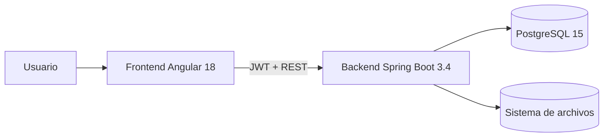

# INSTEIP

<p align="center">
  
</p>

<p align="center">
  
  
  
  
  
</p>

## Resumen

INSTEIP es una plataforma académica para administrar cursos, módulos, videos, materiales, matrículas, avance del alumno, certificados, auditoría y configuración institucional.

El sistema está organizado en tres capas:

- `frontend/`: aplicación Angular 18.
- `backend/`: API REST con Spring Boot 3.4 y Java 21.
- `database/`: scripts SQL y soporte para PostgreSQL 15.

## Arquitectura



## Roles

- `ADMINISTRADOR`: gestiona alumnos, docentes, cursos, reportes, auditoría, sistema y configuración.
- `DOCENTE`: trabaja sobre sus cursos asignados, contenidos y seguimiento de alumnos.
- `ALUMNO`: consume sus cursos matriculados, materiales, certificados y progreso.

## Funcionalidades

- Login con JWT y refresh token.
- CRUD de alumnos y docentes.
- Asignación de docente a curso.
- Gestión de cursos, módulos, videos y materiales.
- Matrículas y progreso por video/curso.
- Certificados PDF con validación pública.
- Diseño premium de certificados con portada institucional, logo reforzado, tipografía más marcada y marca de agua sutil en el PDF.
- Auditoría de login y eventos del sistema.
- Reportes CSV.
- Estado del sistema y backups.

## Estructura del repositorio

```text
📁 raíz
├── backend/           ← API Spring Boot 3.4
├── frontend/          ← App Angular 18
├── database/          ← Scripts SQL
├── docs/              ← Documentación, QA y assets
├── scripts/           ← Tests E2E y utilidades
│   └── downloads/     ← CSVs y PDFs generados por tests
├── run-logs/          ← Logs de ejecución (backend/frontend)
├── .gitignore
├── docker-compose.yml ← PostgreSQL 15
├── package.json       ← Dependencias para scripts (Selenium, Playwright)
└── README.md
```

## Stack Tecnológico

### Frontend

- Angular 18
- TypeScript
- RxJS
- Guards e interceptores HTTP
- Componentes standalone
- **Path aliases**: `@core/*`, `@features/*`, `@env/*`

### Backend

- Spring Boot 3.4
- Java 21
- Spring Security
- Spring Data JPA
- Hibernate
- OpenPDF

### Calidad

- JUnit + Mockito (53 tests)
- Playwright
- Selenium (14 pasos E2E)
- Scripts Node.js para integración

## Rutas

### Públicas

| Ruta | Componente |
|---|---|
| `/inicio` | InicioComponent |
| `/programas` | ProgramasComponent |
| `/recursos` | RecursosComponent |
| `/certificacion` | CertificacionComponent |
| `/por-que-elegirnos` | PorQueElegirnosComponent |
| `/cursos` | PublicCursosComponent |
| `/cursos/:id` | CursoDetallePublicoComponent |
| `/login` | LoginComponent |
| `/certificados/validar/:codigo` | ValidarCertificadoComponent |

### Dashboard (requiere autenticación)

| Ruta | Roles | Componente |
|---|---|---|
| `/dashboard` | Todos | DashboardHomeComponent |
| `/dashboard/perfil` | Todos | PerfilComponent |
| `/dashboard/alumnos` | ADMIN | AlumnosComponent |
| `/dashboard/docentes` | ADMIN | DocentesComponent |
| `/dashboard/cursos` | ADMIN | CursosComponent |
| `/dashboard/configuracion` | ADMIN | ConfiguracionComponent |
| `/dashboard/auditoria` | ADMIN | AuditoriaComponent |
| `/dashboard/sistema` | ADMIN | SistemaComponent |
| `/dashboard/cursos/:id` | ADMIN+DOCENTE | CursoDetalleComponent |
| `/dashboard/modulos/:id/videos` | ADMIN+DOCENTE | VideosComponent |
| `/dashboard/modulos/:id/materiales` | ADMIN+DOCENTE | MaterialesComponent |
| `/dashboard/mis-cursos-docente` | DOCENTE | MisCursosDocenteComponent |
| `/dashboard/mis-alumnos-docente/:id` | DOCENTE | MisAlumnosDocenteComponent |
| `/dashboard/mis-cursos` | ALUMNO | MisCursosComponent |
| `/dashboard/cursos-play/:id` | ALUMNO | PlayCursoComponent |
| `/dashboard/certificados` | ADMIN+ALUMNO | CertificadosComponent |

## API Documentada

### Autenticación

Base: `/api/auth`

- `POST /login`
- `POST /refresh`
- `POST /logout`
- `GET /me`
- `POST /forgot-password`
- `POST /reset-password`

### Usuarios

Base: `/api/usuarios`

- `GET /`
- `GET /{id}`
- `POST /`
- `PUT /{id}`
- `PATCH /{id}/estado`

### Docentes

Base: `/api/usuarios/docentes`

- `GET /`
- `GET /{id}`
- `POST /`
- `PUT /{id}`
- `PATCH /{id}/estado`

### Cursos

Base: `/api/cursos`

- `GET /`
- `GET /{id}`
- `GET /{id}/modulos`
- `POST /`
- `PUT /{id}`
- `PATCH /{id}/estado`

### Módulos

Base: `/api/modulos`

- `GET /{id}`
- `GET /{id}/videos`
- `GET /{id}/materiales`
- `POST /`
- `PUT /{id}`
- `PATCH /{id}/estado`

### Videos

Base: `/api/videos`

- `GET /`
- `POST /`
- `PUT /{id}`
- `PATCH /{id}/estado`

### Materiales

Base: `/api/materiales`

- `POST /`
- `PUT /{id}`
- `PATCH /{id}/estado`
- `GET /{id}/download`

### Matrículas

Base: `/api/matriculas`

- `POST /`
- `GET /curso/{cursoId}`
- `PATCH /{id}/estado`

### Avance

Base: `/api/avance`

- `POST /`
- `GET /video/{id}`

### Certificados

Base: `/api/certificados`

- `GET /`
- `POST /generar/{cursoId}`
- `GET /{id}/download`
- `GET /validar/{codigo}`

Notas:

- La validación pública expone alumno, curso, fecha y código.
- Los certificados se regeneran desde el backend cuando el PDF físico falta o debe repararse.
- La plantilla activa del sistema controla la firma y el cargo institucional.

### Auditoría

Base: `/api/auditoria`

- `GET /login`
- `GET /login/usuario/{id}`
- `GET /eventos`
- `GET /eventos/modulo/{modulo}`
- `GET /eventos/usuario/{id}`

### Reportes

Base: `/api/reportes`

- `GET /alumnos`
- `GET /matriculas`
- `GET /cursos`
- `GET /certificados`

### Sistema

Base: `/api/sistema`

- `GET /status`
- `POST /backup`

### Configuración

Base: `/api/configuracion`

- `GET /`
- `PUT /`

## Inicio Rápido

### Base de datos

```bash
docker compose up -d
```

### Backend

```bash
cd backend
./mvnw spring-boot:run
```

En Windows:

```powershell
cd backend
.\mvnw.cmd spring-boot:run
```

### Frontend

```bash
cd frontend
npm install
npm start
```

## Credenciales de prueba

| Rol | Correo | Contraseña |
|---|---|---|
| Admin | `admin@insteip.com` | `Admin123!` |
| Alumno | `juan.perez@insteip.com` | `Alumno123!` |
| Docente | `docente@insteip.com` | `Docente123!` |

## Notas

- Si cambias rutas, roles o DTOs, actualiza también `docs/contexto.md`.
- La portada SVG se usa como banner de documentación y GitHub.
- Los logs de ejecución se guardan en `run-logs/` (ignorados por git).
- Los scripts de testing y sus descargas están en `scripts/`.
- Documentación de QA completa en `docs/QA_UNIFICADO.md`.
