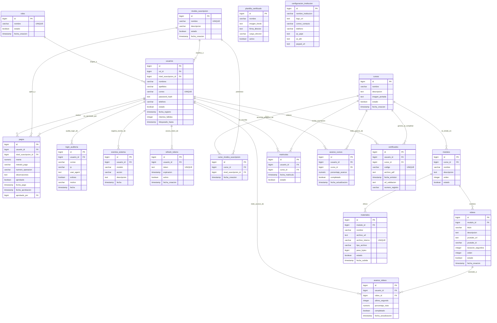

# INSTEIP - Campus Virtual y Plataforma E-Learning

¡Bienvenido al repositorio oficial de **INSTEIP**! Este proyecto es un campus virtual completo y una plataforma de e-learning moderna, diseñada bajo un enfoque modular, seguro y escalable.

El sistema se compone de un backend robusto basado en **Spring Boot 3** y **Java 21**, un frontend reactivo desarrollado en **Angular 18**, y una base de datos relacional robusta en **PostgreSQL 15**.

---

## 📊 1. Arquitectura del Sistema y Diagrama ERD

La plataforma INSTEIP organiza su información a través de 18 tablas relacionales que estructuran los perfiles de usuario, suscripciones, cursos, temarios, seguimiento de progreso y auditorías del sistema.

### Diagrama Entidad-Relación (Mermaid ERD)



---

## 🛠️ 2. Stack Tecnológico Completo

La plataforma INSTEIP utiliza un stack moderno, seguro y optimizado para el aprendizaje en línea:

* **Frontend:**
  * **Framework:** **Angular 18** (TypeScript, Componentes Reactivos, Lazy Loading, Ruteo Protegido y Gestión de Estados).
  * **Estilos y Maquetación:** CSS Vainilla combinado con **Tailwind CSS** (integrado mediante CDN para carga rápida) para un diseño académico y moderno de alta fidelidad.
  * **Multimedia:** Sincronización dinámica de avance con la API de iFrames de YouTube.
* **Backend:**
  * **Framework:** **Spring Boot 3** (Java 21) estructurado en capas limpias de Controladores, Servicios y Repositorios.
  * **Seguridad:** **Spring Security** y Tokens Bearer JWT para autenticación, autorización basada en roles y prevención de fuerza bruta.
  * **Generación de Archivos:** **OpenPDF** para la compilación y exportación de diplomas académicos a formato PDF.
* **Base de Datos y Almacenamiento:**
  * **Base de Datos:** **PostgreSQL 15** para almacenamiento relacional seguro de la información.
  * **Almacenamiento:** Sistema de archivos del servidor para copias de seguridad de datos y materiales didácticos cargados.
* **Automatización y Pruebas (QA):**
  * **Pruebas E2E (UI):** Playwright (Node.js) para la validación visual y flujos interactivos completos.
  * **Pruebas de Integración (API):** Suite personalizada en Node.js para validación masiva de endpoints REST.
  * **Pruebas de Humo:** Selenium WebDriver para comprobaciones rápidas de portales públicos y validaciones.
  * **Pruebas Unitarias:** JUnit y Mockito en el backend.

---

## 📁 3. Estructura del Repositorio

El repositorio se divide en tres directorios principales y herramientas de prueba globales en la raíz:

* **`database/`**: 
  * [database/schema.sql](file:///c:/Users/Alessander/Desktop/TRABAJOS/ACTUALES/Insteip/database/schema.sql) - Esquema DDL en PostgreSQL con relaciones e índices optimizados.
  * [database/seed.sql](file:///c:/Users/Alessander/Desktop/TRABAJOS/ACTUALES/Insteip/database/seed.sql) - Carga de roles, niveles de suscripción, cuentas semilla y transacciones de prueba.
  * [docker-compose.yml](file:///c:/Users/Alessander/Desktop/TRABAJOS/ACTUALES/Insteip/docker-compose.yml) - Orquestador para iniciar la base de datos PostgreSQL localmente en contenedores.
* **`backend/`**:
  * [backend/pom.xml](file:///c:/Users/Alessander/Desktop/TRABAJOS/ACTUALES/Insteip/backend/pom.xml) - Configuración de Maven con librerías de seguridad, base de datos y utilitarios.
  * [backend/src/main/resources/application.properties](file:///c:/Users/Alessander/Desktop/TRABAJOS/ACTUALES/Insteip/backend/src/main/resources/application.properties) - Propiedades de configuración del servidor, subida de archivos (límite 10MB) y credenciales por defecto.
  * [backend/src/main/java/com/insteip/backend/](file:///c:/Users/Alessander/Desktop/TRABAJOS/ACTUALES/Insteip/backend/src/main/java/com/insteip/backend/) - Código fuente estructurado en capas (controllers, services, entities, repositories, security, etc.).
* **`frontend/`**:
  * [frontend/package.json](file:///c:/Users/Alessander/Desktop/TRABAJOS/ACTUALES/Insteip/frontend/package.json) - Dependencias del cliente en **Angular 18**.
  * [frontend/src/app/app.routes.ts](file:///c:/Users/Alessander/Desktop/TRABAJOS/ACTUALES/Insteip/frontend/src/app/app.routes.ts) - Rutas públicas, rutas de estudiante y rutas de administración protegidas con guardianes de roles.
  * [frontend/src/app/core/interceptors/security.interceptor.ts](file:///c:/Users/Alessander/Desktop/TRABAJOS/ACTUALES/Insteip/frontend/src/app/core/interceptors/security.interceptor.ts) - Interceptor HTTP funcional para cabeceras Bearer, guardianes y servicios de conexión.
  * [frontend/src/app/features/](file:///c:/Users/Alessander/Desktop/TRABAJOS/ACTUALES/Insteip/frontend/src/app/features/) - Vistas e interfaces (login, catálogos públicos y panel de control dashboard).
* **QA & Scripts en Raíz**:
  * [super-test.js](file:///c:/Users/Alessander/Desktop/TRABAJOS/ACTUALES/Insteip/super-test.js) - Suite de pruebas visuales automatizadas de extremo a extremo (E2E) con Playwright.
  * [backend-api-super-test.js](file:///c:/Users/Alessander/Desktop/TRABAJOS/ACTUALES/Insteip/backend-api-super-test.js) - Script de prueba de integración de endpoints de API REST.
  * [generate-manual.js](file:///c:/Users/Alessander/Desktop/TRABAJOS/ACTUALES/Insteip/generate-manual.js) - Generador automatizado del Manual de Usuario Visual en PDF/HTML.
  * [selenium-test.js](file:///c:/Users/Alessander/Desktop/TRABAJOS/ACTUALES/Insteip/selenium-test.js) - Script de pruebas de humo y validación pública de firmas con Selenium WebDriver.

---

## 🚀 4. Instrucciones de Despliegue Local

Sigue estos cuatro sencillos pasos para tener todo el sistema corriendo de forma local:

### Paso 1: Levantar la Base de Datos con Docker
Desde la raíz del proyecto, ejecuta:
```bash
docker compose up -d
```
Esto creará e inicializará un contenedor PostgreSQL en el puerto local `5432` con la base de datos `insteip_db`, cargando de forma automática los scripts de esquema y datos semilla.

### Paso 2: Ejecutar el Servidor Backend
Navega a la carpeta backend y ejecuta el servidor de Spring Boot:
```bash
cd backend
mvn spring-boot:run
```
El servidor backend iniciará de forma segura en el puerto **`8081`**. Puedes configurar una ruta absoluta personalizada para la persistencia física de archivos subidos y copias de seguridad definiendo la variable de entorno `STORAGE_PATH` (su valor por defecto es `uploads` relativo al directorio de ejecución).

### Paso 3: Ejecutar el Cliente Frontend
Abre otra terminal, navega a la carpeta frontend, instala las dependencias e inicia el servidor de desarrollo de Angular:
```bash
cd frontend
npm install
npm run start
```
La aplicación cliente se compilará y estará disponible en el navegador en la dirección `http://localhost:4200`.

---

## 🧪 5. Guía de QA y Suites de Prueba

El sistema cuenta con una cobertura integral de QA en backend y frontend para garantizar su correcto funcionamiento.

### A. Pruebas Unitarias del Backend (JUnit + Mockito)
Para correr las pruebas de lógica de autenticación y validación de archivos, ejecuta desde el directorio `backend`:
```bash
mvn test
```

### B. Pruebas de Integración de Endpoints REST
El script `backend-api-super-test.js` ejecuta de manera secuencial 60 pruebas masivas de integración interactuando directamente con el servidor API REST levantado.
```bash
# Ejecutar en la raíz del proyecto
node backend-api-super-test.js
```

### C. Pruebas Visuales Automatizadas E2E (Playwright)
Para validar los flujos visuales completos sobre la interfaz real (login, CRUD de cursos, reproducción interactiva de alumnos y emisión de certificados):
```bash
# Instalar Playwright en el directorio raíz (por primera vez)
npm install

# Correr las pruebas visuales E2E
node super-test.js
```

### D. Pruebas de Humo en Páginas Públicas (Selenium)
Para validar accesos públicos y pasarelas de validación externa de firmas con Selenium WebDriver:
```bash
# Correr pruebas con Selenium WebDriver
node selenium-test.js
```

---

## 🔑 6. Cuentas Semilla y Credenciales de Prueba

Para interactuar con la plataforma una vez desplegada localmente, puedes usar las siguientes credenciales pre-cargadas desde [seed.sql](file:///c:/Users/Alessander/Desktop/TRABAJOS/ACTUALES/Insteip/database/seed.sql):

* **Administrador (Acceso Total al Panel de Control):**
  * **Correo:** `admin@insteip.com`
  * **Contraseña:** `Admin123!`
* **Alumno (Plan Básico por Defecto):**
  * **Correo:** `juan.perez@insteip.com`
  * **Contraseña:** `Alumno123!`
* **Alumno (Plan Premium):**
  * **Correo:** `maria.rodriguez@insteip.com`
  * **Contraseña:** `Alumno123!`

---

## ⚙️ 7. Credenciales de Conexión de Base de Datos
* **Host:** `localhost`
* **Puerto:** `5432`
* **Base de Datos:** `insteip_db`
* **Usuario:** `insteip_user`
* **Contraseña:** `insteip_password`
