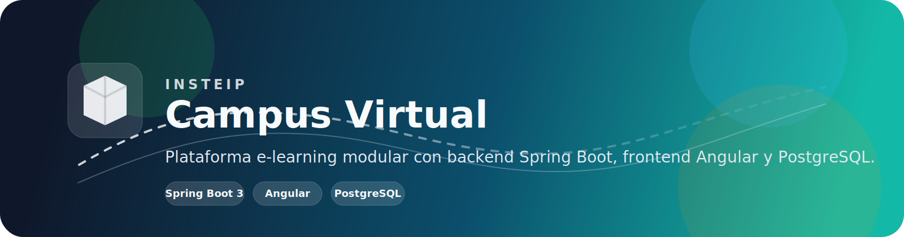
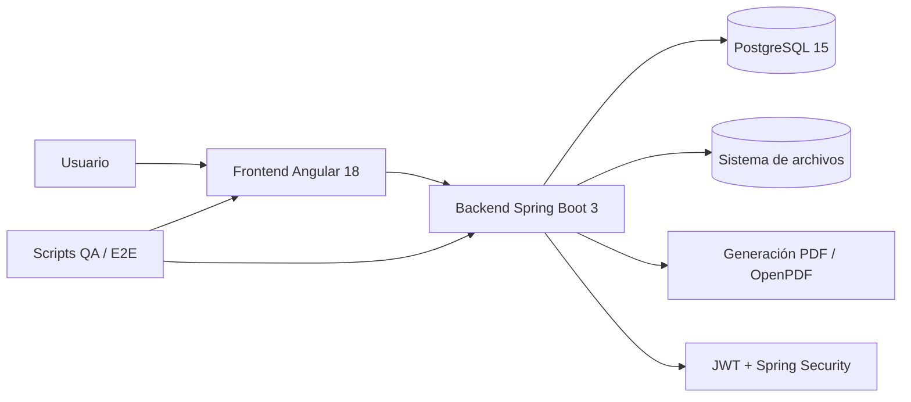
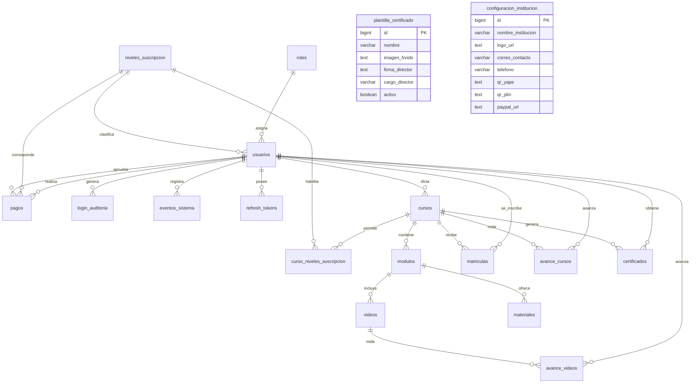

# INSTEIP - Campus Virtual y Plataforma E-Learning



INSTEIP es una plataforma de aprendizaje en línea pensada para gestionar cursos, módulos, materiales, avances, certificados y auditoría del sistema desde una arquitectura moderna y modular.

El proyecto está organizado en tres capas principales:
- `backend/`: API REST con Spring Boot 3 y Java 21.
- `frontend/`: interfaz web en Angular 18.
- `database/`: esquema, datos semilla y soporte para PostgreSQL.

---

## Resumen Rápido

- Autenticación con JWT y Spring Security.
- Gestión de usuarios, cursos, módulos, videos, materiales y matrículas.
- Seguimiento de progreso por alumno.
- Generación y validación de certificados PDF.
- Paneles diferenciados para administrador, docente y alumno.
- Suite de pruebas para backend, frontend y validación pública.

---

## Diagramas

### Arquitectura General



### Modelo Entidad Relación



---

## Tecnologías

- Backend: Spring Boot 3, Java 21, Spring Data JPA, Spring Security, Lombok, OpenPDF.
- Frontend: Angular 18, TypeScript, Tailwind CSS.
- Base de datos: PostgreSQL 15.
- QA: JUnit, Mockito, Playwright, Selenium y scripts de integración en Node.js.

---

## Estructura del Repositorio

- `backend/`: servicio principal API REST.
- `frontend/`: cliente Angular.
- `database/`: `schema.sql`, `seed.sql` y recursos de despliegue.
- `manual-assets/`: capturas y material visual del proyecto.
- `super-test.js`: suite masiva de integración de la API.
- `backend-api-super-test.js`: validación directa de endpoints.
- `selenium-test.js`: pruebas de humo y validación pública.
- `generate-manual.js`: generador del manual de usuario.

---

## Requisitos

- Java 21
- Maven 3.9+ o el wrapper incluido en `backend/`
- Node.js 18+ para scripts y frontend
- PostgreSQL 15
- Docker y Docker Compose, si vas a levantar la base local con contenedores

---

## Instalación Local

### 1. Base de datos

Desde la raíz del proyecto:

```bash
docker compose up -d
```

Esto levanta PostgreSQL y carga el esquema y los datos semilla definidos en `database/`.

### 2. Backend

```bash
cd backend
./mvnw spring-boot:run
```

En Windows también puedes usar:

```powershell
cd backend
.\mvnw.cmd spring-boot:run
```

El backend suele exponer la API en `http://localhost:8081`.

### 3. Frontend

```bash
cd frontend
npm install
npm start
```

La app normalmente queda disponible en `http://localhost:4200`.

---

## QA y Pruebas

### Backend

```bash
cd backend
./mvnw test
```

### Integración de API

```bash
node backend-api-super-test.js
```

### E2E visual

```bash
npm install
node super-test.js
```

### Selenium

```bash
node selenium-test.js
```

---

## Credenciales de Prueba

### Administrador
- Correo: `admin@insteip.com`
- Contraseña: `Admin123!`

### Alumno
- Correo: `juan.perez@insteip.com`
- Contraseña: `Alumno123!`

### Alumna
- Correo: `maria.rodriguez@insteip.com`
- Contraseña: `Alumno123!`

---

## Base de Datos

- Host: `localhost`
- Puerto: `5432`
- Base de datos: `insteip_db`
- Usuario: `insteip_user`
- Contraseña: `insteip_password`

---

## Capturas

Algunas capturas útiles del proyecto están en `manual-assets/`:

- `manual-assets/01_login.png`
- `manual-assets/02_admin_dashboard.png`
- `manual-assets/10_student_dashboard.png`
- `manual-assets/12_student_reproductor.png`
- `manual-assets/15_validacion_publica.png`

---

## Notas

- Si cambias rutas, credenciales o puertos, actualiza también los scripts de QA y el manual.
- Si quieres publicar el proyecto en GitHub, el banner SVG queda visible directamente desde este `README.md`.
