# INSTEIP

<p align="center">
  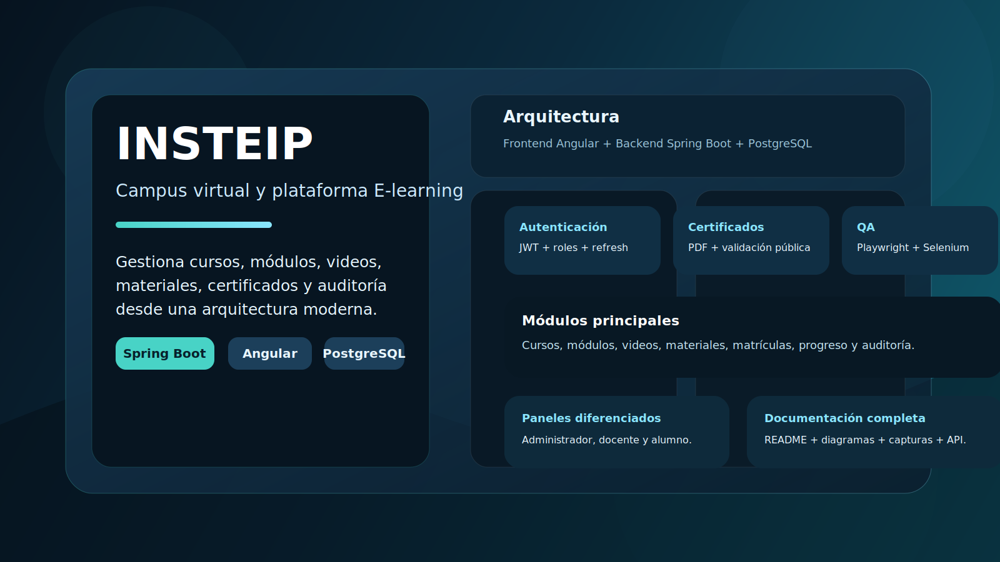
</p>

<p align="center">
  <a href="#inicio-rapido"></a>
  
  
  
  
</p>

<p align="center">
  
  
  
  
  
</p>

## Tabla de Contenidos

- [Resumen](#resumen)
- [Captura de portada](#captura-de-portada)
- [Características](#caracter%C3%ADsticas)
- [Arquitectura](#arquitectura)
- [Stack tecnológico](#stack-tecnológico)
- [Estructura del repositorio](#estructura-del-repositorio)
- [Modelo de datos](#modelo-de-datos)
- [Funcionalidades principales](#funcionalidades-principales)
- [Rutas de la aplicación](#rutas-de-la-aplicación)
- [Flujo de uso](#flujo-de-uso)
- [Requisitos](#requisitos)
- [Inicio rápido](#inicio-rápido)
- [QA y pruebas](#qa-y-pruebas)
- [Credenciales de prueba](#credenciales-de-prueba)
- [Base de datos](#base-de-datos)
- [Galería](#galería)
- [Notas de mantenimiento](#notas-de-mantenimiento)

## Resumen

INSTEIP es una plataforma de aprendizaje en línea para gestionar cursos, módulos, videos, materiales, matrículas, avance académico, certificados y auditoría del sistema.

La solución está separada en tres capas:

- `backend/`: API REST con Spring Boot 3 y Java 21.
- `frontend/`: aplicación web con Angular 18.
- `database/`: esquema, datos semilla y soporte para PostgreSQL.

## Captura de portada

La portada del proyecto está pensada como una mini landing page para GitHub y documentación interna. La imagen se encuentra en `manual-assets/insteip-landing-cover.svg`.

## Características

- Autenticación con JWT y Spring Security.
- Control de acceso por roles.
- Gestión de usuarios, cursos, módulos, videos, materiales y matrículas.
- Seguimiento del progreso del alumno por video y por curso.
- Generación de certificados PDF con validación pública.
- Auditoría de accesos y eventos del sistema.
- Paneles separados para administrador, docente y alumno.
- Validaciones de descarga de materiales y contenido protegido.
- Base preparada para ejecución local con Docker Compose.

## Arquitectura

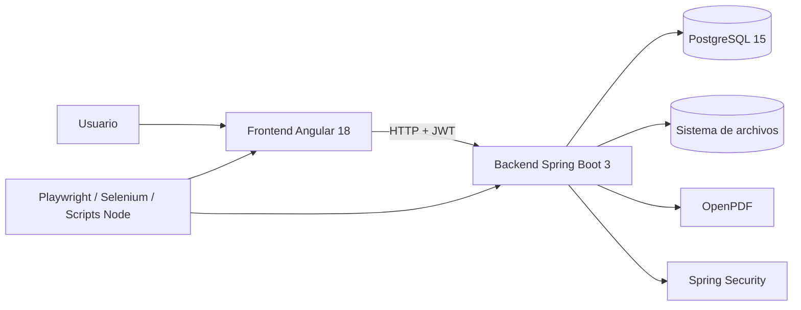

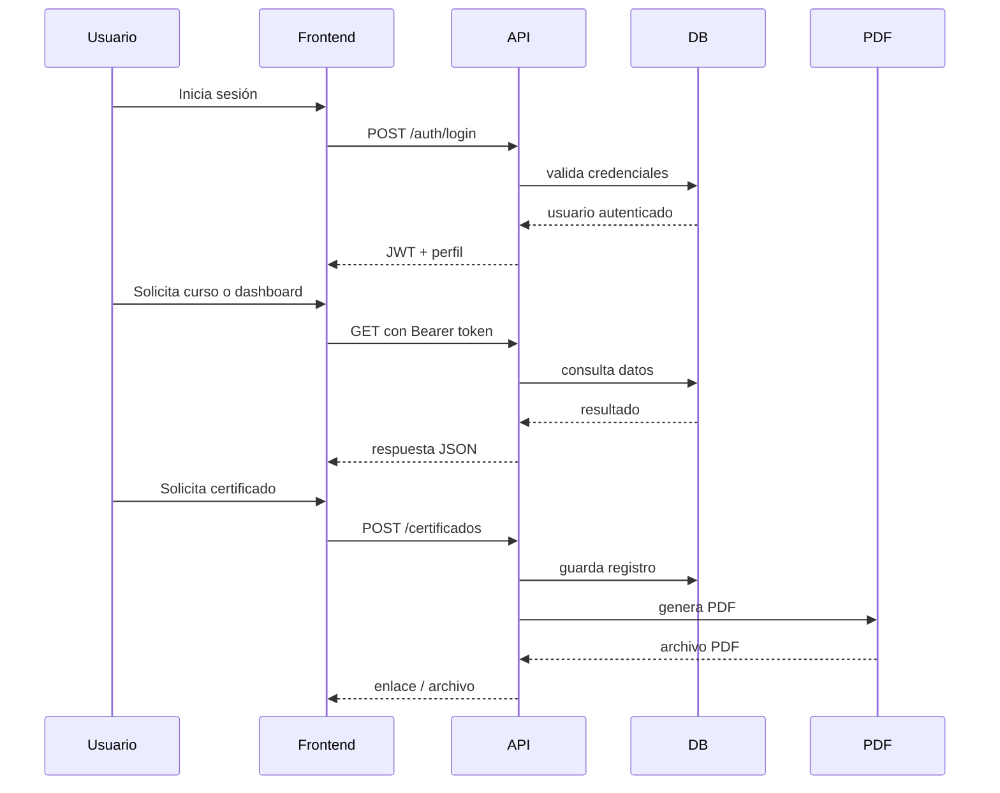

## Stack tecnológico

### Backend

- Spring Boot 3.4
- Java 21
- Spring Data JPA
- Spring Security
- Lombok
- JJWT
- OpenPDF
- PostgreSQL Driver

### Frontend

- Angular 18
- TypeScript
- RxJS
- CSS global y utilidades Tailwind
- Guards, interceptores y servicios centralizados

### Calidad y automatización

- JUnit
- Mockito
- Playwright
- Selenium WebDriver
- Scripts Node.js para integración

## Estructura del repositorio

```text
.
├── backend/            # API REST Spring Boot
├── database/           # SQL de esquema y datos semilla
├── frontend/           # SPA Angular
├── manual-assets/      # Capturas y banner
├── super-test.js       # E2E visual con Playwright
├── backend-api-super-test.js
├── selenium-test.js
├── generate-manual.js
└── README.md
```

## Modelo de datos

Las entidades principales del sistema incluyen:

- `roles`
- `niveles_suscripcion`
- `usuarios`
- `pagos`
- `login_auditoria`
- `eventos_sistema`
- `refresh_tokens`
- `cursos`
- `curso_niveles_suscripcion`
- `modulos`
- `videos`
- `materiales`
- `matriculas`
- `avance_videos`
- `avance_cursos`
- `certificados`
- `plantilla_certificado`
- `configuracion_institucion`

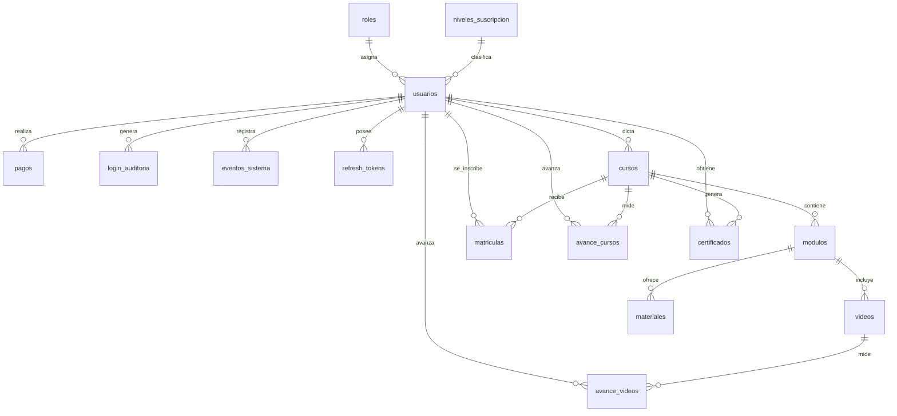

## Funcionalidades principales

### Acceso y seguridad

- Login con JWT.
- Refresh tokens para sesión persistente.
- Control de intentos fallidos.
- Protecciones para rutas administrativas y recursos descargables.

### Campus virtual

- Catálogo de cursos.
- Detalle público de cursos.
- Matrícula y seguimiento del progreso.
- Reproductor de videos con avance persistente.
- Materiales por módulo.

### Certificados

- Emisión de certificados en PDF.
- Validación pública por código.
- Integración con firma e identidad institucional.

### Administración

- Gestión de alumnos.
- Gestión de cursos, módulos, videos y materiales.
- Auditoría de eventos y accesos.
- Parámetros globales de la institución.
- Estado del sistema y copias de seguridad.

## Rutas de la aplicación

### Públicas

- `/inicio`
- `/programas`
- `/recursos`
- `/certificacion`
- `/por-que-elegirnos`
- `/cursos`
- `/cursos/:id`
- `/login`
- `/certificados/validar/:codigo`

### Estudiante

- `/dashboard/mis-cursos`
- `/dashboard/cursos-play/:id`
- `/dashboard/certificados`
- `/dashboard/perfil`

### Docente

- `/dashboard/docente/mis-cursos`
- `/dashboard/docente/mis-alumnos`

### Administrador

- `/dashboard/alumnos`
- `/dashboard/cursos`
- `/dashboard/cursos/:id`
- `/dashboard/certificados`
- `/dashboard/auditoria`
- `/dashboard/sistema`
- `/dashboard/configuracion`

## Flujo de uso

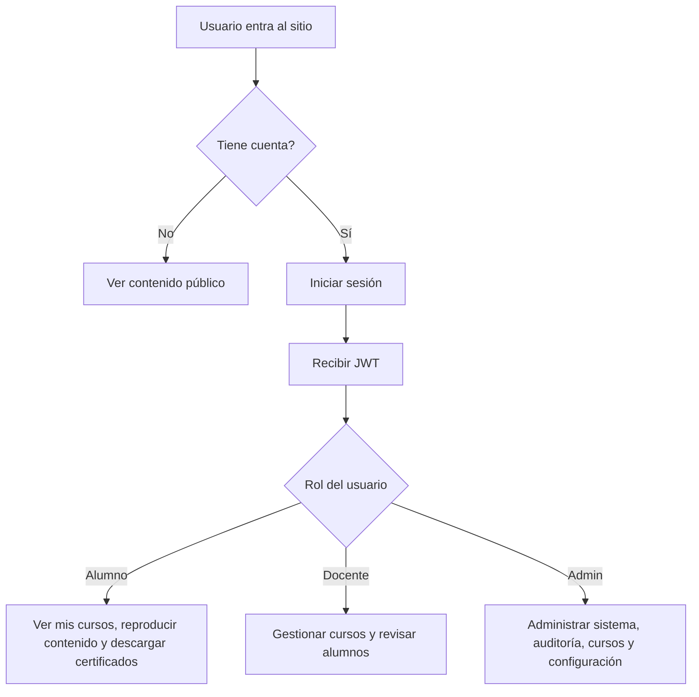

## Requisitos

- Java 21
- Maven 3.9+ o wrapper incluido en `backend/`
- Node.js 18+ y npm
- PostgreSQL 15
- Docker y Docker Compose para levantar la base local

## Inicio rápido

### 1. Base de datos

```bash
docker compose up -d
```

Esto levanta PostgreSQL y carga el esquema y los datos semilla definidos en `database/`.

### 2. Backend

```bash
cd backend
./mvnw spring-boot:run
```

En Windows:

```powershell
cd backend
.\mvnw.cmd spring-boot:run
```

El backend suele exponerse en `http://localhost:8081`.

### 3. Frontend

```bash
cd frontend
npm install
npm start
```

La aplicación normalmente queda disponible en `http://localhost:4200`.

## QA y pruebas

### Backend

```bash
cd backend
./mvnw test
```

### Integración de API

```bash
node backend-api-super-test.js
```

### E2E visual

```bash
npm install
node super-test.js
```

### Selenium

```bash
node selenium-test.js
```

### Compilación del frontend

```bash
cd frontend
npm run build
```

## API documentada

La API está organizada bajo el prefijo `/api`. A continuación, la documentación principal por recurso.

### Autenticación

Base: `/api/auth`

| Método | Endpoint | Descripción | Acceso |
|---|---|---|---|
| `POST` | `/login` | Inicia sesión y devuelve el JWT junto con datos del usuario. | Público |
| `POST` | `/refresh` | Renueva el token de acceso usando un refresh token. | Público |
| `POST` | `/logout` | Revoca la sesión actual. | Autenticado |
| `GET` | `/me` | Retorna el perfil del usuario autenticado. | Autenticado |
| `POST` | `/forgot-password` | Solicita el flujo de recuperación de contraseña. | Público |
| `POST` | `/reset-password` | Restablece la contraseña con el token enviado. | Público |

### Usuarios

Base: `/api/usuarios`

| Método | Endpoint | Descripción | Acceso |
|---|---|---|---|
| `GET` | `/` | Lista alumnos con paginación y búsqueda opcional. | ADMINISTRADOR |
| `GET` | `/{id}` | Obtiene el detalle de un alumno. | ADMINISTRADOR |
| `POST` | `/` | Crea un alumno. | ADMINISTRADOR |
| `PUT` | `/{id}` | Actualiza un alumno. | ADMINISTRADOR |
| `PATCH` | `/{id}/estado` | Activa o desactiva el estado del alumno. | ADMINISTRADOR |

### Cursos

Base: `/api/cursos`

| Método | Endpoint | Descripción | Acceso |
|---|---|---|---|
| `GET` | `/` | Lista cursos con paginación y búsqueda. | ADMINISTRADOR |
| `GET` | `/{id}` | Obtiene el detalle de un curso. | ADMINISTRADOR o acceso autorizado al curso |
| `GET` | `/{id}/modulos` | Lista módulos de un curso. | ADMINISTRADOR o acceso autorizado al curso |
| `POST` | `/` | Crea un curso. | ADMINISTRADOR |
| `PUT` | `/{id}` | Actualiza un curso. | ADMINISTRADOR |
| `PATCH` | `/{id}/estado` | Activa o desactiva un curso. | ADMINISTRADOR |

### Matrículas

Base: `/api/matriculas`

| Método | Endpoint | Descripción | Acceso |
|---|---|---|---|
| `POST` | `/` | Matricula un alumno en un curso. | ADMINISTRADOR |
| `GET` | `/curso/{cursoId}` | Lista los alumnos matriculados en un curso. | ADMINISTRADOR |
| `PATCH` | `/{id}/estado` | Activa o desactiva una matrícula. | ADMINISTRADOR |

### Módulos

Base: `/api/modulos`

| Método | Endpoint | Descripción | Acceso |
|---|---|---|---|
| `GET` | `/{id}` | Obtiene el detalle de un módulo. | ADMINISTRADOR o acceso autorizado al módulo |
| `GET` | `/{id}/videos` | Lista videos del módulo. | ADMINISTRADOR o acceso autorizado al módulo |
| `GET` | `/{id}/materiales` | Lista materiales del módulo. | ADMINISTRADOR o acceso autorizado al módulo |
| `POST` | `/` | Crea un módulo dentro de un curso. | ADMINISTRADOR o acceso autorizado al curso |
| `PUT` | `/{id}` | Actualiza un módulo. | ADMINISTRADOR o acceso autorizado al módulo |
| `PATCH` | `/{id}/estado` | Activa o desactiva un módulo. | ADMINISTRADOR o acceso autorizado al módulo |

### Videos

Base: `/api/videos`

| Método | Endpoint | Descripción | Acceso |
|---|---|---|---|
| `GET` | `/` | Lista videos con paginación. | ADMINISTRADOR |
| `POST` | `/` | Crea un video. | ADMINISTRADOR o acceso autorizado al módulo |
| `PUT` | `/{id}` | Actualiza un video. | ADMINISTRADOR o acceso autorizado al video |
| `PATCH` | `/{id}/estado` | Activa o desactiva un video. | ADMINISTRADOR o acceso autorizado al video |

### Materiales

Base: `/api/materiales`

| Método | Endpoint | Descripción | Acceso |
|---|---|---|---|
| `POST` | `/` | Sube un material al módulo indicado. | ADMINISTRADOR o acceso autorizado al módulo |
| `PUT` | `/{id}` | Edita el material y, si aplica, reemplaza el archivo. | ADMINISTRADOR o acceso autorizado al material |
| `PATCH` | `/{id}/estado` | Activa o desactiva un material. | ADMINISTRADOR o acceso autorizado al material |
| `GET` | `/{id}/download` | Descarga un material protegido. | ADMINISTRADOR, DOCENTE o ALUMNO |

### Avance

Base: `/api/avance`

| Método | Endpoint | Descripción | Acceso |
|---|---|---|---|
| `POST` | `/` | Guarda el progreso de un video para el usuario autenticado. | ALUMNO o ADMINISTRADOR |
| `GET` | `/video/{id}` | Obtiene el progreso registrado para un video. | ALUMNO o ADMINISTRADOR |

### Certificados

Base: `/api/certificados`

| Método | Endpoint | Descripción | Acceso |
|---|---|---|---|
| `GET` | `/` | Lista certificados con búsqueda opcional. | ADMINISTRADOR o ALUMNO |
| `POST` | `/generar/{cursoId}` | Genera un certificado para un curso. | ADMINISTRADOR o ALUMNO |
| `GET` | `/{id}/download` | Descarga el PDF del certificado. | ADMINISTRADOR o ALUMNO |
| `GET` | `/validar/{codigo}` | Valida un certificado públicamente. | Público |

### Auditoría

Base: `/api/auditoria`

| Método | Endpoint | Descripción | Acceso |
|---|---|---|---|
| `GET` | `/login` | Lista auditorías de inicio de sesión con filtros por fecha, correo y resultado. | ADMINISTRADOR |
| `GET` | `/login/usuario/{id}` | Lista auditoría de login por usuario. | ADMINISTRADOR |
| `GET` | `/eventos` | Lista eventos del sistema. | ADMINISTRADOR |
| `GET` | `/eventos/modulo/{modulo}` | Lista eventos filtrados por módulo. | ADMINISTRADOR |
| `GET` | `/eventos/usuario/{id}` | Lista eventos de un usuario. | ADMINISTRADOR |

### Reportes

Base: `/api/reportes`

| Método | Endpoint | Descripción | Acceso |
|---|---|---|---|
| `GET` | `/alumnos` | Exporta el listado de alumnos a CSV. | ADMINISTRADOR |
| `GET` | `/matriculas` | Exporta las matrículas a CSV. | ADMINISTRADOR |
| `GET` | `/cursos` | Exporta los cursos a CSV. | ADMINISTRADOR |
| `GET` | `/certificados` | Exporta los certificados a CSV. | ADMINISTRADOR |

### Sistema

Base: `/api/sistema`

| Método | Endpoint | Descripción | Acceso |
|---|---|---|---|
| `POST` | `/backup` | Ejecuta un backup manual del sistema. | ADMINISTRADOR |
| `GET` | `/status` | Retorna estado del backend, base de datos, disco, memoria, CPU y último backup. | ADMINISTRADOR |

### Configuración

Base: `/api/configuracion`

| Método | Endpoint | Descripción | Acceso |
|---|---|---|---|
| `GET` | `/` | Obtiene la configuración institucional activa. | ADMINISTRADOR |
| `PUT` | `/` | Actualiza la configuración institucional. | ADMINISTRADOR |

### Paneles y soporte

Otros controladores importantes del backend siguen el mismo patrón REST y exponen servicios para:

- `GET /api/alumno-dashboard/...`
- `GET /api/docente-dashboard/...`
- `GET /api/pagos/...`
- `GET /api/video...` según el alcance administrativo

> Nota: las rutas de paneles y soporte pueden variar según la vista o el DTO consumido por el frontend. El backend protege el acceso por rol y por permisos asociados al curso, módulo, video o material.

## Credenciales de prueba

### Administrador

- Correo: `admin@insteip.com`
- Contraseña: `Admin123!`

### Alumno

- Correo: `juan.perez@insteip.com`
- Contraseña: `Alumno123!`

### Alumna

- Correo: `maria.rodriguez@insteip.com`
- Contraseña: `Alumno123!`

## Base de datos

- Host: `localhost`
- Puerto: `5432`
- Base de datos: `insteip_db`
- Usuario: `insteip_user`
- Contraseña: `insteip_password`

## Galería

Capturas incluidas en `manual-assets/`:

<p align="center">
  
  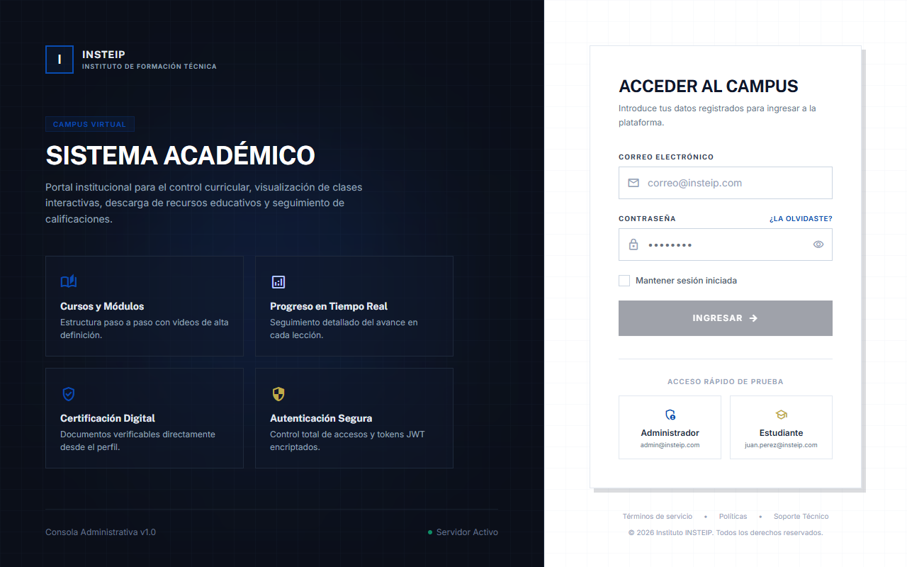
  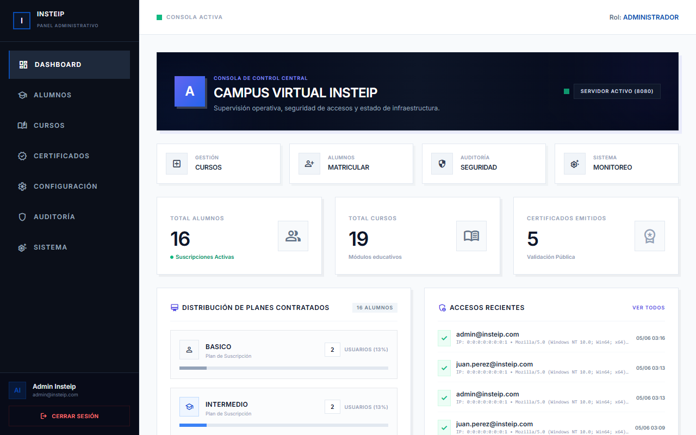
  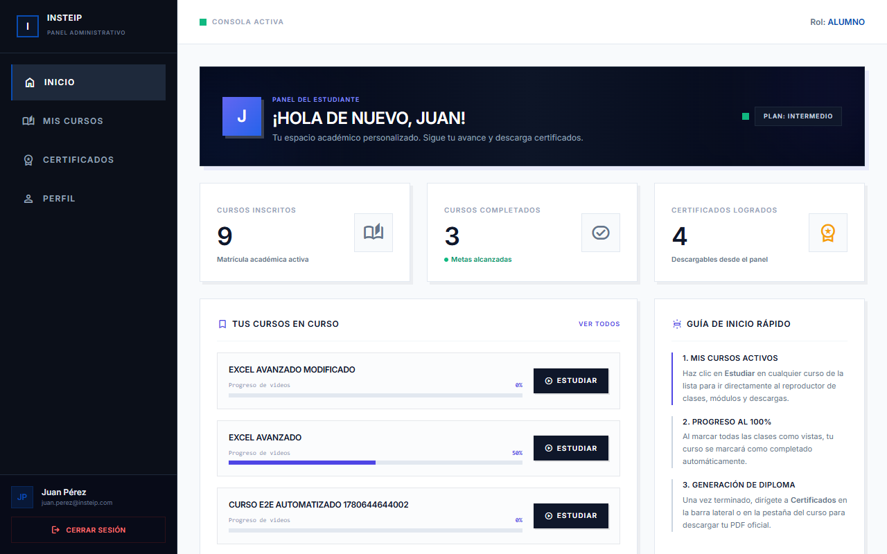
</p>

<p align="center">
  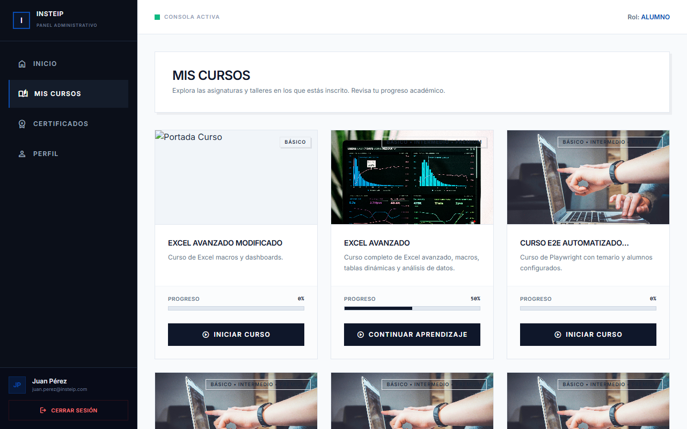
  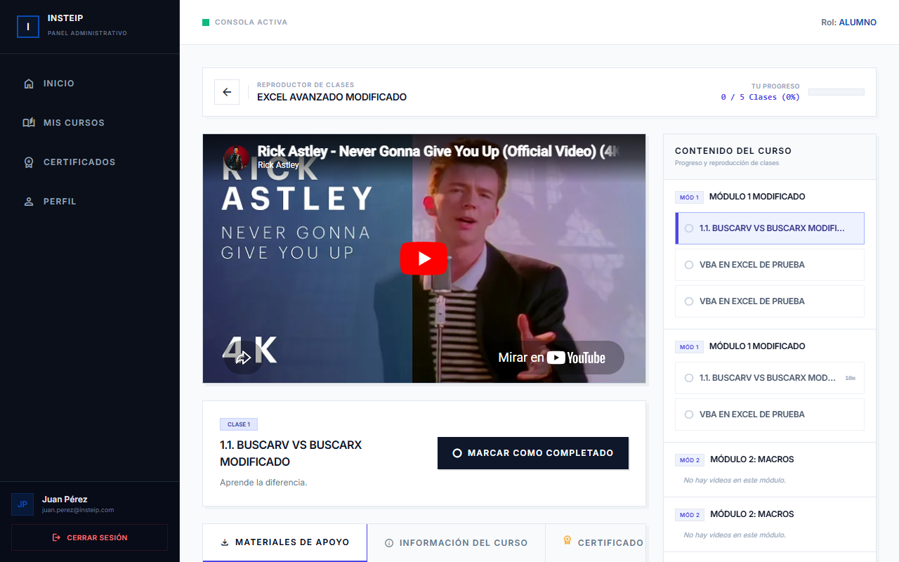
  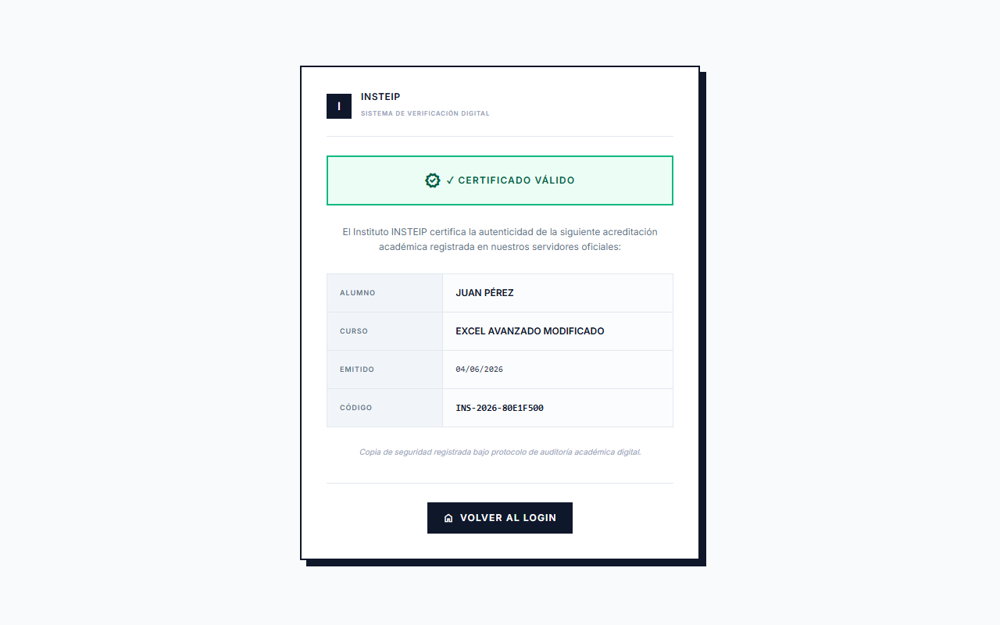
</p>

## Notas de mantenimiento

- Si cambias rutas, credenciales o puertos, actualiza también los scripts de QA y el manual.
- Si agregas pantallas nuevas, procura reflejarlas en la galería y en las rutas principales.
- El banner SVG se muestra directamente desde este `README.md` en GitHub.
