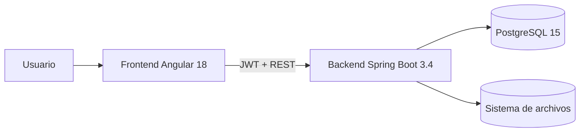

# INSTEIP

<p align="center">
  
</p>

<p align="center">
  
  
  
  
  
</p>

## Resumen

INSTEIP es una plataforma académica para administrar cursos, módulos, videos, materiales, matrículas, avance del alumno, certificados, auditoría y configuración institucional.
La documentación del proyecto y los flujos de QA ya están alineados con el estado actual del sistema, incluyendo paneles por rol, filtros unificados y validación pública de certificados.

El sistema está organizado en tres capas:

- `frontend/`: aplicación Angular 18.
- `backend/`: API REST con Spring Boot 3.4 y Java 21.
- `database/`: scripts SQL y soporte para PostgreSQL 15.

## Arquitectura



## Roles

- `ADMINISTRADOR`: gestiona alumnos, docentes, cursos, reportes, auditoría, sistema y configuración.
- `DOCENTE`: trabaja sobre sus cursos asignados, contenidos y seguimiento de alumnos.
- `ALUMNO`: consume sus cursos matriculados, materiales, certificados y progreso.

## Funcionalidades

- Login con JWT y refresh token.
- CRUD de alumnos y docentes.
- Asignación de docente a curso.
- Gestión de cursos, módulos, videos y materiales.
- Matrículas y progreso por video/curso.
- Certificados PDF con validación pública.
- Diseño premium de certificados con portada institucional, logo reforzado, tipografía más marcada y marca de agua sutil en el PDF.
- Auditoría de login y eventos del sistema.
- Reportes CSV.
- Estado del sistema y backups.

## Captura de portada

La portada personalizada del proyecto está en `docs/assets/insteip-landing-cover.svg`.

## Stack Tecnológico

### Frontend

- Angular 18
- TypeScript
- RxJS
- Guards e interceptores HTTP
- Componentes standalone

### Backend

- Spring Boot 3.4
- Java 21
- Spring Security
- Spring Data JPA
- Hibernate
- OpenPDF

### Calidad

- JUnit
- Mockito
- Playwright
- Scripts Node.js para integración

## Estructura del repositorio

```text
.
├── backend/
├── database/
├── frontend/
├── docs/
├── scripts/
├── contexto.md
└── README.md
```

## Rutas

### Públicas

- `/inicio`
- `/programas`
- `/recursos`
- `/certificacion`
- `/por-que-elegirnos`
- `/cursos`
- `/cursos/:id`
- `/login`
- `/certificados/validar/:codigo`

### Privadas

- `/dashboard`
- `/dashboard/alumnos`
- `/dashboard/docentes`
- `/dashboard/cursos`
- `/dashboard/cursos/:id`
- `/dashboard/certificados`
- `/dashboard/auditoria`
- `/dashboard/sistema`
- `/dashboard/configuracion`
- `/dashboard/mis-cursos`
- `/dashboard/cursos-play/:id`
- `/dashboard/perfil`
- `/dashboard/mis-cursos-docente`
- `/dashboard/mis-alumnos-docente/:id`

## API Documentada

### Autenticación

Base: `/api/auth`

- `POST /login`
- `POST /refresh`
- `POST /logout`
- `GET /me`
- `POST /forgot-password`
- `POST /reset-password`

### Usuarios

Base: `/api/usuarios`

- `GET /`
- `GET /{id}`
- `POST /`
- `PUT /{id}`
- `PATCH /{id}/estado`

### Docentes

Base: `/api/usuarios/docentes`

- `GET /`
- `GET /{id}`
- `POST /`
- `PUT /{id}`
- `PATCH /{id}/estado`

### Cursos

Base: `/api/cursos`

- `GET /`
- `GET /{id}`
- `GET /{id}/modulos`
- `POST /`
- `PUT /{id}`
- `PATCH /{id}/estado`

### Módulos

Base: `/api/modulos`

- `GET /{id}`
- `GET /{id}/videos`
- `GET /{id}/materiales`
- `POST /`
- `PUT /{id}`
- `PATCH /{id}/estado`

### Videos

Base: `/api/videos`

- `GET /`
- `POST /`
- `PUT /{id}`
- `PATCH /{id}/estado`

### Materiales

Base: `/api/materiales`

- `POST /`
- `PUT /{id}`
- `PATCH /{id}/estado`
- `GET /{id}/download`

### Matrículas

Base: `/api/matriculas`

- `POST /`
- `GET /curso/{cursoId}`
- `PATCH /{id}/estado`

### Avance

Base: `/api/avance`

- `POST /`
- `GET /video/{id}`

### Certificados

Base: `/api/certificados`

- `GET /`
- `POST /generar/{cursoId}`
- `GET /{id}/download`
- `GET /validar/{codigo}`

Notas:

- La validación pública expone alumno, curso, fecha y código.
- Los certificados se regeneran desde el backend cuando el PDF físico falta o debe repararse.
- La plantilla activa del sistema controla la firma y el cargo institucional.

### Auditoría

Base: `/api/auditoria`

- `GET /login`
- `GET /login/usuario/{id}`
- `GET /eventos`
- `GET /eventos/modulo/{modulo}`
- `GET /eventos/usuario/{id}`

### Reportes

Base: `/api/reportes`

- `GET /alumnos`
- `GET /matriculas`
- `GET /cursos`
- `GET /certificados`

### Sistema

Base: `/api/sistema`

- `GET /status`
- `POST /backup`

### Configuración

Base: `/api/configuracion`

- `GET /`
- `PUT /`

## Inicio Rápido

### Base de datos

```bash
docker compose up -d
```

### Backend

```bash
cd backend
./mvnw spring-boot:run
```

En Windows:

```powershell
cd backend
.\mvnw.cmd spring-boot:run
```

### Frontend

```bash
cd frontend
npm install
npm start
```

## QA Reciente

Estado comprobado recientemente:

- `backend`: `./mvnw test -q`
- `frontend`: `npm run build`
- `scripts/backend-api-super-test.js`
- `scripts/selenium-test.js`
- `scripts/super-test.js`

Los scripts de QA cubren autenticación, roles, paneles, CRUD principales, certificados, validación pública y monitoreo del sistema.

## QA

- `./mvnw test -q` en `backend/`
- `npm run build` en `frontend/`
- `node backend-api-super-test.js`
- `node super-test.js`

## Credenciales de prueba

- Admin: `admin@insteip.com` / `Admin123!`
- Alumno: `juan.perez@insteip.com` / `Alumno123!`
- Docente: `docente@insteip.com` / `Docente123!`

## Notas

- Si cambias rutas, roles o DTOs, actualiza también `contexto.md`.
- La portada SVG se usa como banner de documentación y GitHub.
- El panel administrativo ya incluye acceso a `Docentes`.
