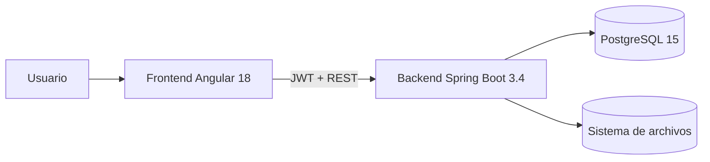

# INSTEIP

<p align="center">
  
</p>

<p align="center">
  
  
  
  
  
</p>

## Resumen

INSTEIP es una plataforma académica para administrar cursos, módulos, videos, materiales, matrículas, avance del alumno, certificados, auditoría y configuración institucional.

El sistema está organizado en tres capas:

- `frontend/`: aplicación Angular 18.
- `backend/`: API REST con Spring Boot 3.4 y Java 21.
- `database/`: scripts SQL y soporte para PostgreSQL 15.

## Arquitectura


```mermaid
flowchart LR
    U[Usuario] --> F[Frontend Angular 18]
    F -->|JWT + REST| B[Backend Spring Boot 3.4]
    B --> P[(PostgreSQL 15)]
    B --> FS[(Sistema de archivos)]
```

## Roles

- `ADMINISTRADOR`: gestiona alumnos, docentes, cursos, reportes, auditoría, sistema y configuración.
- `DOCENTE`: trabaja sobre sus cursos asignados, contenidos y seguimiento de alumnos.
- `ALUMNO`: consume sus cursos matriculados, materiales, certificados y progreso.

## Funcionalidades

- **Autenticación y Seguridad**: Login con JWT y refresh token, control de sesiones, protección de rutas y perfiles por rol.
- **Gestión Académica Completa**: CRUD de alumnos y docentes, asignación de docentes, cursos, módulos, videos de clases y materiales descargables en PDF.
- **Sistema de Tareas y Evaluaciones**: Publicación de asignaciones por módulo con fecha límite, subida de entregas de alumnos (PDF/Word) y calificación docente sobre 20 con retroalimentación personalizada.
- **Notificaciones en Tiempo Real**: Campanita 🔔 con conteo dinámico de avisos no leídos, triggers automáticos (nuevos videos, materiales, tareas publicadas, notas asignadas y matrículas) y redirección directa con 1 clic.
- **Comunicados Segmentados**: Panel administrativo para redactar avisos dirigidos a toda la comunidad o segmentados por rol (`TODOS`, `SOLO_ESTUDIANTES`, `SOLO_DOCENTES`, `DOCENTES_Y_ESTUDIANTES` o `POR_CURSO`).
- **Anuncios Promocionales en Pop-Up**: Banners/flyers emergentes en modal con botón CTA (WhatsApp o curso) y control de frecuencia diario en `localStorage`.
- **Reproductor de Clases Avanzado**: Selector de clases, persistencia de tiempo visto, pantalla completa, avance/retroceso táctil y botón sutil para activar/desactivar subtítulos CC.
- **Asistente Virtual con IA**: Chatbot flotante interactivo potenciado con modelos Llama 3 / Groq y contexto institucional de INSTEIP.
- **Certificados Digitales**: Generación de diplomas en PDF con validación pública vía código QR y diseño institucional premium.
- **Auditoría y Supervisión**: Registro detallado de logins, acciones del sistema, reportes exportables en CSV y métricas en vivo.

## Estructura del repositorio

```text
📁 raíz
├── backend/           ← API Spring Boot 3.4 (Java 21)
├── frontend/          ← Aplicación Angular 18 Standalone
├── database/          ← Migraciones y scripts SQL
├── docs/              ← Documentación técnica y QA
├── scripts/           ← Tests E2E y utilidades de automatización
├── .gitignore
├── docker-compose.yml ← PostgreSQL 15 y servicios
├── package.json       ← Scripts auxiliares
└── README.md
```

## Stack Tecnológico

### Frontend

- Angular 18 (Componentes Standalone)
- TypeScript & RxJS (Polling reactivo y state management)
- TailwindCSS & Diseño UI personalizado
- Guards e Interceptores HTTP
- **Path aliases**: `@core/*`, `@features/*`, `@env/*`

### Backend

- Spring Boot 3.4 & Java 21 LTS
- Spring Security (JWT Stateless)
- Spring Data JPA & Hibernate 6
- PostgreSQL 15
- OpenPDF (Generación de certificados oficiales)

### Calidad

- JUnit 5 + Mockito (Suite de pruebas unitarias y de integración WebMvc)
- Playwright & Selenium E2E
- Tests automatizados de endpoints y validación de seguridad

## Rutas del Sistema

### Públicas

| Ruta | Componente | Descripción |
|---|---|---|
| `/inicio` | InicioComponent | Página principal con catálogo y presentación |
| `/programas` | ProgramasComponent | Programas académicos |
| `/recursos` | RecursosComponent | Biblioteca y recursos libres |
| `/certificacion` | CertificacionComponent | Información sobre certificaciones |
| `/por-que-elegirnos` | PorQueElegirnosComponent | Beneficios y propuesta de valor |
| `/cursos` | PublicCursosComponent | Listado público de cursos |
| `/cursos/:id` | CursoDetallePublicoComponent | Ficha informativa de curso |
| `/login` | LoginComponent | Acceso a la plataforma |
| `/certificados/validar/:codigo` | ValidarCertificadoComponent | Validador público de autenticidad |

### Dashboard (Privado)

| Ruta | Roles Permitidos | Descripción |
|---|---|---|
| `/dashboard` | Todos | Consola principal adaptada por rol |
| `/dashboard/perfil` | Todos | Datos de cuenta y cambio de contraseña |
| `/dashboard/alumnos` | ADMINISTRADOR | Gestión y matrícula de estudiantes |
| `/dashboard/docentes` | ADMINISTRADOR | Gestión de plana docente |
| `/dashboard/cursos` | ADMINISTRADOR | Mantenimiento de cursos y contenidos |
| `/dashboard/comunicados` | ADMINISTRADOR | Envío de comunicados y gestión de pop-ups |
| `/dashboard/configuracion` | ADMINISTRADOR | Configuración general y logos |
| `/dashboard/auditoria` | ADMINISTRADOR | Logs de accesos y eventos |
| `/dashboard/sistema` | ADMINISTRADOR | Monitoreo del servidor y copias de seguridad |
| `/dashboard/cursos/:id` | ADMIN / DOCENTE | Editor de módulos, videos y materiales |
| `/dashboard/mis-cursos-docente` | DOCENTE | Panel docente de cursos asignados |
| `/dashboard/mis-alumnos-docente/:id` | DOCENTE | Calificación y seguimiento de alumnos |
| `/dashboard/mis-cursos` | ALUMNO | Mis cursos matriculados |
| `/dashboard/mis-tareas` | ALUMNO | Mis evaluaciones, entregas y notas |
| `/dashboard/cursos-play/:id` | ALUMNO | Reproductor de clases y contenidos |

## Endpoints Principales de la API

### Notificaciones y Comunicados (`/api/notificaciones`)
- `GET /mis-notificaciones?limite=20`: Consulta de avisos personales y contador no leídas.
- `PATCH /{id}/leer`: Marcar notificación individual como leída.
- `PATCH /leer-todas`: Marcar todas las notificaciones como leídas.
- `POST /comunicado`: Envío de comunicado administrativo con segmentación de audiencia.

### Anuncios Pop-up (`/api/anuncios-modal`)
- `GET /activo`: Consulta de anuncio promocional vigente según rol del usuario.
- `GET /todos`: Listado completo de campañas para el administrador.
- `POST /`: Creación de nuevo anuncio/flyer.
- `PUT /{id}`: Modificación de anuncio.
- `PATCH /{id}/estado`: Activar o pausar campaña.
- `DELETE /{id}`: Eliminación de anuncio.

### Tareas y Calificaciones (`/api/tareas` y `/api/entregas-tareas`)
- `GET /api/tareas/modulo/{moduloId}`: Tareas asociadas a un módulo.
- `POST /api/tareas`: Creación de tarea (Admin/Docente).
- `GET /api/entregas-tareas/mis-entregas/curso/{cursoId}`: Entregas del estudiante.
- `POST /api/entregas-tareas`: Subida de archivo de entrega.
- `POST /api/entregas-tareas/{id}/calificar`: Calificación sobre 20 y feedback del docente.

### Asistente IA (`/api/chatbot`)
- `POST /api/chatbot/preguntar`: Consulta contextual al asistente inteligente.

### Autenticación y Cursos
- `POST /api/auth/login`, `POST /api/auth/refresh`, `GET /api/auth/me`
- `GET /api/cursos`, `GET /api/cursos/{id}/modulos`, `GET /api/modulos/{id}/videos`
- `POST /api/avance`, `POST /api/matriculas`

## Inicio Rápido

### Base de datos

```bash
docker compose up -d
```

### Backend

```bash
cd backend
./mvnw spring-boot:run
```

En Windows (PowerShell):

```powershell
cd backend
.\mvnw.cmd spring-boot:run
```

### Frontend

```bash
cd frontend
npm install
npm start
```

## Notas del Proyecto

- Las migraciones de base de datos se organizan secuencialmente en `backend/src/main/resources/db/`.
- Todos los componentes y servicios siguen una arquitectura limpia, aditiva y modular.
- Documentación de control de calidad disponible en `docs/QA_UNIFICADO.md`.
