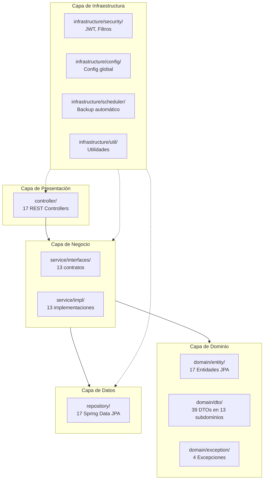

# Backend - INSTEIP

## Arquitectura por Capas



### Estructura de Paquetes

```
com.insteip.backend
├── controller/               ← CAPA DE PRESENTACIÓN
├── service/interfaces/       ← CAPA DE NEGOCIO
├── service/impl/
├── repository/               ← CAPA DE DATOS
├── domain/
│   ├── dto/{13 subdominios}/ ← DTOs
│   ├── entity/               ← Entidades JPA
│   └── exception/            ← Excepciones
└── infrastructure/
    ├── security/
    ├── config/
    ├── scheduler/
    └── util/
```

## Stack Tecnológico

- **Java 21**
- **Spring Boot 3.4**
- **Spring Security + JWT**
- **Spring Data JPA / Hibernate**
- **PostgreSQL 15**
- **OpenPDF** (generación de certificados PDF)
- **Lombok** (reducción de boilerplate)

## Convenciones de Código

1. **Controladores**: Solo manejan request/response, delegan toda la lógica a servicios.
2. **Servicios**: Contienen la lógica de negocio. Siempre con interfaz + implementación.
3. **DTOs**: Organizados por subdominio dentro de `domain/dto/`. Usar records de Java.
4. **Entidades**: Clases JPA con Lombok, en `domain/entity/`.
5. **Excepciones**: Clases personalizadas en `domain/exception/`, manejadas globalmente por `GlobalExceptionHandler`.
6. **Repositorios**: Spring Data JPA, en `repository/`.
7. **Infraestructura**: Configuración, seguridad y utilidades en `infrastructure/`.

## Despliegue Local

```bash
# 1. Iniciar base de datos
docker compose up -d

# 2. Compilar y ejecutar
./mvnw spring-boot:run

# 3. Compilar solo (verificar errores)
./mvnw compile

# 4. Ejecutar tests
./mvnw test
```

## Endpoints Principales

| Método | Ruta | Descripción |
|--------|------|-------------|
| POST | `/api/auth/login` | Iniciar sesión |
| POST | `/api/auth/refresh` | Refrescar token |
| GET | `/api/auth/me` | Perfil del usuario |
| GET/POST/PUT | `/api/cursos` | CRUD de cursos |
| GET/POST/PUT | `/api/modulos` | CRUD de módulos |
| GET/POST | `/api/videos` | CRUD de videos |
| GET/POST | `/api/materiales` | CRUD de materiales |
| GET/POST | `/api/matriculas` | Matrículas |
| GET/POST | `/api/certificados` | Certificados |
| POST | `/api/avance` | Progreso de video |
| POST | `/api/sistema/backup` | Backup manual |

## Variables de Entorno

| Variable | Default | Descripción |
|----------|---------|-------------|
| `DB_URL` | `jdbc:postgresql://localhost:5432/insteip_db` | URL de BD |
| `DB_USERNAME` | `postgres` | Usuario BD |
| `DB_PASSWORD` | (vacío) | Contraseña BD |
| `API_BASE_URL` | `http://localhost:8081` | URL base API |
| `FRONTEND_BASE_URL` | `http://localhost:4200` | URL base frontend |
| `STORAGE_PATH` | `uploads` | Ruta de almacenamiento |
