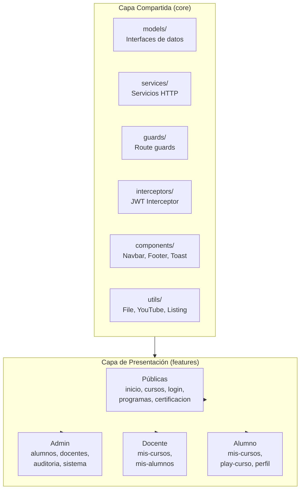

# Frontend - INSTEIP

## Arquitectura



### Estructura de Directorios

```
src/app/
├── core/                          ← CAPA COMPARTIDA
│   ├── models/index.ts             ← Barrel exports
│   ├── services/index.ts           ← Barrel exports
│   ├── guards/index.ts             ← Barrel exports
│   ├── interceptors/index.ts       ← Barrel exports
│   ├── components/                 ← Componentes compartidos
│   └── utils/index.ts              ← Barrel exports
└── features/                       ← CAPA DE PRESENTACIÓN (por dominio)
    ├── inicio/                     ─ Página de inicio
    ├── auth/login/                 ─ Inicio de sesión
    ├── cursos/                     ─ Cursos públicos y detalle
    ├── dashboard/                  ─ Paneles privados por rol
    └── ...
```

## Stack Tecnológico

- **Angular 18** (Standalone Components)
- **TypeScript**
- **RxJS** (Observables)
- **Angular Router** (Lazy Loading)
- **CSS3** (sin frameworks externos)

## Convenciones de Código

1. **Modelos**: Interfaces TypeScript en `core/models/`. Usar barrel exports (`index.ts`) para imports limpios.
2. **Servicios**: Clases con inyección de dependencias en `core/services/`. Barrel exports disponibles.
3. **Componentes**: Standalone components organizados por feature en `features/`.
4. **Guards**: Funciones standalone en `core/guards/` para protección de rutas.
5. **Interceptor**: Un único interceptor de seguridad en `core/interceptors/`.
6. **Componentes compartidos**: Elementos reutilizables (navbar, footer, toast) en `core/components/`.
7. **Rutas**: Lazy loading en `app.routes.ts` con guards por rol.

## Despliegue Local

```bash
# 1. Instalar dependencias
npm install

# 2. Iniciar servidor de desarrollo
npm start

# 3. Compilar para producción
npm run build

# 4. Verificar tipos
npx tsc --noEmit
```

## Rutas Principales

### Públicas
| Ruta | Componente |
|------|------------|
| `/inicio` | Inicio |
| `/programas` | Programas |
| `/recursos` | Recursos |
| `/certificacion` | Certificación |
| `/cursos` | Cursos públicos |
| `/cursos/:id` | Detalle de curso |
| `/login` | Inicio de sesión |
| `/certificados/validar/:codigo` | Validar certificado |

### Privadas (requieren autenticación)
| Ruta | Rol | Componente |
|------|-----|------------|
| `/dashboard` | Todos | Home del dashboard |
| `/dashboard/alumnos` | Admin | Gestión de alumnos |
| `/dashboard/docentes` | Admin | Gestión de docentes |
| `/dashboard/cursos` | Admin | CRUD de cursos |
| `/dashboard/auditoria` | Admin | Registro de auditoría |
| `/dashboard/sistema` | Admin | Estado del sistema |
| `/dashboard/configuracion` | Admin | Configuración |
| `/dashboard/mis-cursos` | Alumno | Cursos matriculados |
| `/dashboard/cursos-play/:id` | Alumno | Reproductor |
| `/dashboard/perfil` | Todos | Perfil de usuario |
| `/dashboard/mis-cursos-docente` | Docente | Cursos asignados |

## Barrel Exports

El proyecto utiliza barrel exports (`index.ts`) para simplificar los imports:

```typescript
// En lugar de:
import { AuthService } from './core/services/auth.service';
import { CursoService } from './core/services/curso.service';
import { CursoRequest, CursoResponse } from './core/models/curso.model';

// Usar:
import { AuthService, CursoService } from './core/services';
import { CursoRequest, CursoResponse } from './core/models';
```
